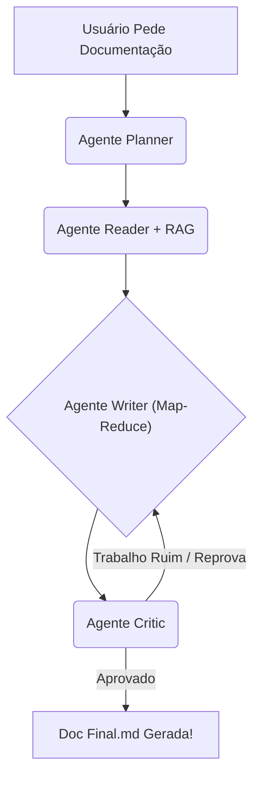

<div align="center">
  <h1>🤖 Agentic Code Verification (RAG & Multi-Agent)</h1>
  <p><strong>Um ecossistema inteligente de Agentes Autônomos de IA desenhado para ler, analisar e documentar repositórios de código de forma massiva e precisa.</strong></p>
  
  [](https://www.python.org/downloads/)
  [](https://python.langchain.com/)
  [](https://github.com/MervinPraison/PraisonAI)
  [](https://azure.microsoft.com/)
</div>

---

## 📖 O que é este projeto?

Imagine que você tem um repositório de código gigante, escrito por dezenas de pessoas, e **ninguém fez a documentação**. Entender o que cada arquivo faz levaria meses.

O **Agentic Code Verification** resolve esse problema criando uma "empresa virtual de desenvolvedores seniores" (Agentes de Inteligência Artificial) que trabalham juntos para ler o seu projeto inteiro e escrever a documentação oficial dele para você.

Aqui, nós juntamos duas tecnologias incríveis:
1. **Sistemas Multi-Agentes**: Múltiplas IAs "conversando" entre si. Temos IAs que planejam, IAs que leem arquivos, IAs que escrevem e IAs que julgam a qualidade do texto.
2. **RAG (Retrieval-Augmented Generation)**: Um banco de dados vetorial ("memória externa") que permite que a IA "pesquise" regras de negócio, tabelas de banco de dados e arquivos de arquitetura do seu projeto para não inventar nada da própria cabeça (alucinação).

---

## 👨‍💻 Para quem é este projeto?

- **Estudante de 1º Período (Iniciante):** Se você está começando, este projeto vai te mostrar na prática como a Arquitetura de Software Moderna funciona. Você aprenderá como usar Python não apenas para fazer continhas, mas para construir "robôs" que acessam o computador, leem arquivos reais e interagem com a API do ChatGPT/Azure. É um excelente lugar para entender como a IA está sendo usada no mundo real!
- **Desenvolvedor Sênior/Arquiteto:** Se você já é experiente, notará a adoção rigorosa de padrões como **Ports and Adapters (Hexagonal Architecture)**, inversão de dependência (IoC), Padrão ReAct (Reasoning and Acting) implementado do zero, Map-Reduce para paralelismo de LLM com ThreadPoolExecutor e integração nativa com ChromaDB para o motor vetorial RAG.

---

## ✨ Como a Mágica Acontece? (Fluxo de Trabalho)

A IA não faz tudo de uma vez. Ela foi construída usando o padrão **Grafos de Estado** (State Machines). O fluxo de trabalho funciona na seguinte ordem:

1. 🗺️ **Planner (O Arquiteto):** Recebe o pedido do usuário e monta um plano de ataque estruturado de como a documentação deve ser estruturada.
2. 📖 **Reader (O Leitor):** Varre os arquivos físicos do computador e busca no **RAG (Banco de Dados Vetorial Chroma)** as partes relevantes que o código precisa para ser entendido.
3. ✍️ **Writer (O Escritor - Padrão Map-Reduce):**
   - **Fase Map:** O Escritor divide o código lido em vários pedaços e delega para "Sub-agentes" analisarem em **paralelo** (usando multithreading). Esses sub-agentes procuram por fluxos de execução, riscos e contratos públicos.
   - **Fase Reduce:** O Escritor "Master" pega a análise de todo mundo e consolida num único arquivo Markdown exaustivo, incluindo diagramas ASCII da arquitetura.
4. 🧑‍⚖️ **Critic (O Juiz Hierárquico - via PraisonAI):** Lê o documento pronto. Ele não é bonzinho. Se a documentação estiver superficial, faltar tratamento de erros ou citar arquivos que não existem, ele **reprova** o documento, aponta os erros técnicos e devolve para o Escritor refazer. O ciclo só para quando a nota do Crítico for alta o suficiente!



---

## 🚀 Como Rodar o Projeto na Sua Máquina (Passo a Passo)

### Pré-requisitos
1. **Python 3.10 ou superior** instalado. Verifique abrindo o terminal e digitando `python --version`.
2. O **Git** instalado.

### 1. Clonando e Preparando o Ambiente

Abra o terminal e digite:
```bash
# 1. Clone o repositório
git clone https://github.com/SEU_USUARIO/agentic-code-verification.git
cd agentic-code-verification

# 2. Crie um ambiente virtual para não misturar dependências (Boas Práticas!)
python -m venv .venv

# 3. Ative o ambiente virtual
# No Windows PowerShell:
.venv\Scripts\Activate.ps1
# No Linux/Mac:
source .venv/bin/activate

# 4. Instale as bibliotecas necessárias
pip install -r requirements.txt
```

### 2. Configurando o Cérebro (Integração com LLM)

Este projeto foi otimizado para usar a inteligência do **Azure OpenAI** (modelos da família GPT-4), mas você pode adaptá-lo para outras APIs trocando as chaves.

1. Na raiz do projeto, crie um arquivo chamado `.env` (ou use o existente).
2. Adicione as suas chaves da nuvem (não coloque aspas):

```properties
AZURE_OPENAI_API_KEY=sua_chave_secreta_aqui
AZURE_OPENAI_ENDPOINT=https://sua-instancia.openai.azure.com/
AZURE_OPENAI_API_VERSION=2024-02-15-preview
AZURE_OPENAI_DEPLOYMENT_NAME=gpt-4-turbo
```

*(Lembre-se: O `.gitignore` garante que esse arquivo nunca vá para o GitHub).*

### 3. Rodando o Robô!

Você controla todo o ecossistema através da linha de comando oficial do projeto, o arquivo `cli.py`. Tudo o que ele precisa é do caminho (pasta) do projeto ou script que você quer que ele estude.

No terminal, execute:
```bash
python cli.py "C:\caminho\para\uma\pasta\com\codigo"
```

O terminal ganhará vida! Você começará a ver logs bonitos mostrando o Arquiteto planejando, o Reader indexando o código, as Threads paralelas de análise e o Crítico julgando a qualidade do texto final.

No final, um arquivo Markdown gigante e maravilhoso será criado na pasta local `generated_docs/`.

---

## 📂 Arquitetura Descomplicada do Repositório

Organizamos o código usando **Clean Architecture** (Arquitetura Limpa), dividindo o projeto por responsabilidades:

- **`cli.py`**: A principal porta de entrada do usuário via terminal.
- **`src/`**: O coração do projeto.
  - **`agents/`**: Onde moram os "Profissionais Virtuais" (Planner, Reader, Writer).
    - **`react_core.py`**: O loop principal de raciocínio da IA que coordena as aprovações.
  - **`infrastructure/`**: Onde a IA conversa com o "Mundo Externo" (APIs, Bancos).
    - `adapters/praison_critic.py`: O adaptador que insere a lógica avançada da biblioteca [PraisonAI](https://docs.praison.ai/) para gerenciar agentes de análise de qualidade.
  - **`services/`**: Lógicas de negócio como varredura recursiva de pastas (`codebase_scanner.py`).
  - **`utils/`**: Funções ajudantes como particionador de texto (`text_splitter.py`) em pedaços e o motor inteligente do ChromaDB (`rag_tools.py`).

---

## 🛠️ Modificando as Regras de Negócio

- **Deseja que a IA seja mais rígida?**
Abra o arquivo `src/infrastructure/adapters/praison_critic.py` e aumente a régua no prompt `master_prompt`. Você pode mandar ela reprovar qualquer score abaixo de 9.0!
- **Deseja que a documentação explique menos ou explique mais coisas?**
Vá em `src/agents/specialized/writer.py`. Lá está a ordem "matriz" do fluxo Map-Reduce. Você tem total controle sobre os "Obrigações Exaustivas" que o modelo deve cuspir em JSON.

---

## 🤝 Quer Contribuir?
Pull requests são super bem-vindos. Fique à vontade para fazer "fork" do repositório, testar com os modelos grátis LLaMA rodando em Ollama Local, melhorar o prompt dos agentes, implementar testes de regressão automatizados ou criar novos sub-agentes. 

---
<div align="center">
  <i>Construído com obsessão por Código Limpo e Agentes Autônomos.</i>
</div>
