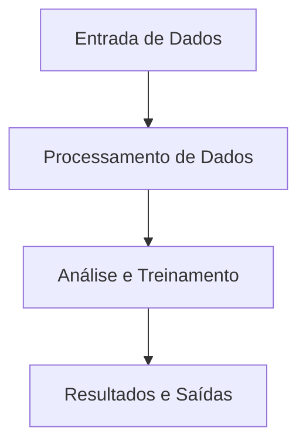
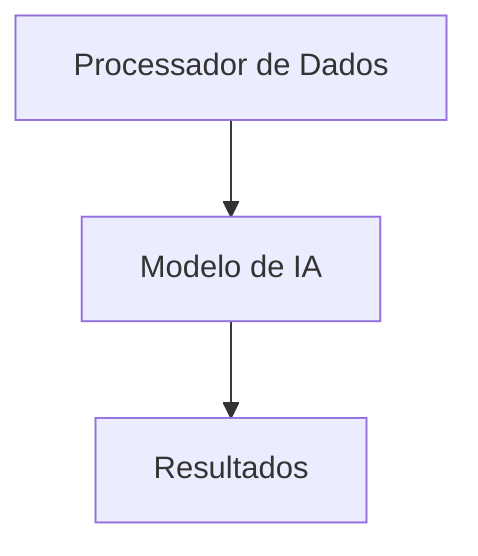

# Visão Geral do Projeto
O projeto intitulado "Aula de Engenharia de IA" é uma aplicação educacional destinada a ensinar os fundamentos e as práticas da engenharia de inteligência artificial. As funcionalidades principais incluem:
- Fundamentos e Arquitetura de Modelos
- Embeddings e Vector Bases
- Context Engineering
- Agents
- Fine Tuning
- Pipeline de Início ao Fim

## Contexto de Negócio
Este projeto serve como uma plataforma de aprendizado para estudantes e profissionais que desejam aprimorar suas habilidades em inteligência artificial, abordando tanto a teoria quanto a prática.

# Tecnologias e Dependências
- **Python**: Linguagem de programação principal.
- **Bibliotecas**:
  - `tensorflow==2.20.0`
  - `ipykernel==7.1.0`
  - `dotenv==0.9.9`
  - `anthropic==0.73.0`
  - `tiktoken==0.12.0`
  - `numpy==2.3.5`
  - `langgraph==1.0.3`

# Arquitetura do Sistema
O sistema é estruturado em um notebook Jupyter que integra teoria e prática através de células de código e markdown. Ele utiliza um padrão arquitetural de notebook, permitindo a execução interativa de trechos de código e a visualização imediata dos resultados.

### Padrões de Design
- **Programação Orientada a Objetos** (POO) para encapsulação de lógicas de operação em funções.
- **Pipeline de Dados** que permite a sequência lógica de operações a partir de dados de entrada até a saída final.

# Fluxo de Execução com Diagrama
O fluxo de execução do sistema é linear e interativo. A seguir está um diagrama que representa o fluxo em formato Mermaid:


## Passo a Passo do Fluxo
1. **Entrada de Dados**: Dados são recebidos através de variáveis ou arquivos.
2. **Processamento de Dados**: Os dados entram em funções que preparam e transformam esses dados para posterior uso.
3. **Análise e Treinamento**: Algoritmos de machine learning são utilizados para treinar modelos com os dados preparados.
4. **Resultados e Saídas**: Resultados são apresentados ao usuário através de visualizações ou outputs em texto.

# Componentes Chave
- **Modelo de IA**
  - **Responsabilidade**: Realiza treino e inferência com dados.
  - **Interfaces Públicas**: `train(data)`, `predict(input)`.
  - **Interações**: Interage com o módulo de processamento de dados e utiliza bibliotecas como TensorFlow.

- **Processador de Dados**
  - **Responsabilidade**: Limpeza e preparação dos dados de entrada.
  - **Interfaces Públicas**: `prepare(data)`, `clean(data)`.
  - **Interações**: Recebe dados de entrada e fornece dados limpos ao modelo.

# Fluxo de Dados
Os dados são recebidos na forma de entradas no notebook, processados pelo Processador de Dados, e então enviados ao Modelo de IA para treinamento e previsões. Os resultados são apresentados ao usuário no mesmo ambiente de notebook.

# Configuração e Uso
Para configurar e executar o projeto, siga as instruções:
1. **Pré-requisitos**: Python 3.8 ou superior.
2. **Instalação**: Instale as dependências usando o comando:
   ```bash
   pip install -r requirements.txt
   ```
3. **Execução**: Execute o Jupyter Notebook:
   ```bash
   jupyter notebook "Aula Engenharia de IA.ipynb"
   ```

# Dependências Entre Módulos
O diagrama abaixo representa as dependências entre os principais módulos:


Esta documentação técnica foi criada para fornecer uma visão clara e precisa do sistema e de sua arquitetura.