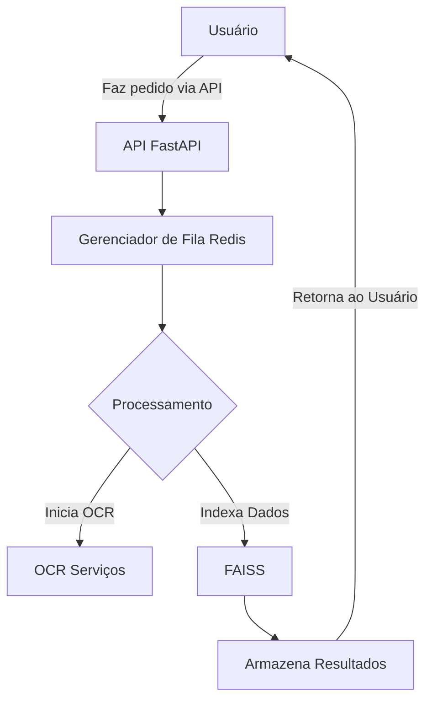
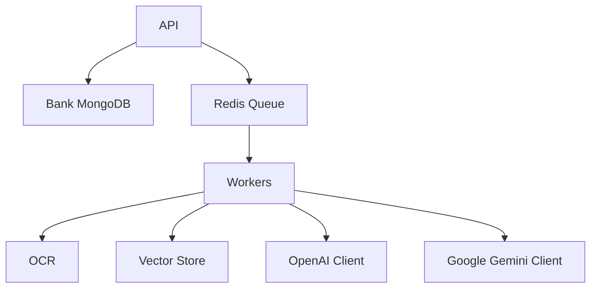

# Visão Geral do Projeto

O projeto **RAG-MPMG** é uma API para processamento de Inteligência Artificial voltada para a transformação de normas internas do Ministério Público de Minas Gerais (MPMG) em um formato consultável. O sistema realiza OCR (Reconhecimento Óptico de Caracteres) de documentos, extração de texto, indexação, e busca vetorial, facilitando o acesso a informações normativas.

## Funcionalidades principais
- OCR de documentos (Surya OCR).
- Extração de texto e normalização.
- Chunking orientado a estrutura normativa.
- Extração de metadados (tipo, órgão, ano, número, etc.).
- Vetorização e indexação usando FAISS.
- Busca híbrida com filtros contextuais.
- API REST construída com FastAPI.
- Processamento distribuído opcional usando Ray.

# Tecnologias e Dependências
- **Python**: >= 3.13
- **FastAPI**: 0.115.14
- **Ray**: 2.47.1
- **PyMuPDF**: 1.26.1
- **Surya OCR**: 0.14.6
- **FAISS**: 1.13.2
- **MongoDB**: >= 5.0
- **Qdrant**: >= 1.7.0
- **Dependências adicionais**: (listadas no arquivo requirements.txt).

# Arquitetura do Sistema
O sistema é construído usando uma arquitetura baseada em microserviços com os seguintes componentes principais:
- **API**: exposta via FastAPI, gerenciando rotas e pedidos.
- **Banco de dados**: MongoDB para armazenamento de documentos e metadados.
- **Gerenciamento de filas**: Redis para gerenciamento de tarefas e prioridades em processamento.
- **Processamento distribuído**: Via Ray para gerenciar tarefas em paralelo.
- **Serviços de API externa**: Clientes para integração com serviços de IA como Azure e Google Gemini.

# Fluxo de Execução com Diagrama
O fluxo básico de execução do sistema é o seguinte:
1. Recepção de um pedido via API.
2. Análise do pedido e extração de informações necessárias.
3. Início do processo através de uma fila de tarefas.
4. Execução de tarefas em paralelo, incluindo OCR e indexação.
5. Armazenamento de resultados e retornos na API.



# Componentes Chave
### 1. API
- **Responsabilidade**: Gerenciamento de rotas e retorno de informações ao usuário.
- **Interfaces Públicas**: `app.include_router(v1_router)`.

### 2. Banco de Dados (MongoDB)
- **Responsabilidade**: Armazenamento de dados e metadados de documentos.
- **Interfaces Públicas**: Métodos da classe `MongoDB` para CRUD.

### 3. Gerenciador de Fila (Redis)
- **Responsabilidade**: Gerenciamento de prioridade e estado das tarefas em execução.
- **Interfaces Públicas**: `enqueue_task`, `get_job_status`.

### 4. Cliente Azure OpenAI
- **Responsabilidade**: Comunicação com a API da Azure OpenAI para geração de texto.
- **Interfaces Públicas**: `get_response_text`.

### 5. Cliente Google Gemini
- **Responsabilidade**: Integração com o Google Gemini para análise de texto.
- **Interfaces Públicas**: `get_response_text`.

# Fluxo de Dados
Os dados fluem da seguinte maneira:
1. O usuário faz um pedido via API.
2. A API valida e insere o pedido na fila.
3. Um trabalhador é chamado para processar a tarefa (OCR, indexação, etc.).
4. Resultados são retornados para a base de dados e a API é atualizada.
5. A API responde ao usuário com os resultados ou mensagens de erro.

# Configuração e Uso
## Pré-requisitos
- Python >= 3.13
- MongoDB
- Redis
- HDFS (opcional)

## Instalação
```bash
git clone <url-do-repositorio>
cd RAG-MPMG
python -m venv venv
venv\Scripts\activate
pip install -r requirements.txt
```

## Execução da API
Para iniciar a API, execute:
```bash
uvicorn main:app --host 0.0.0.0 --port 8000 --reload
```

Endpoints disponíveis:
- API: http://localhost:8000
- Docs: http://localhost:8000/docs

# Dependências Entre Módulos
