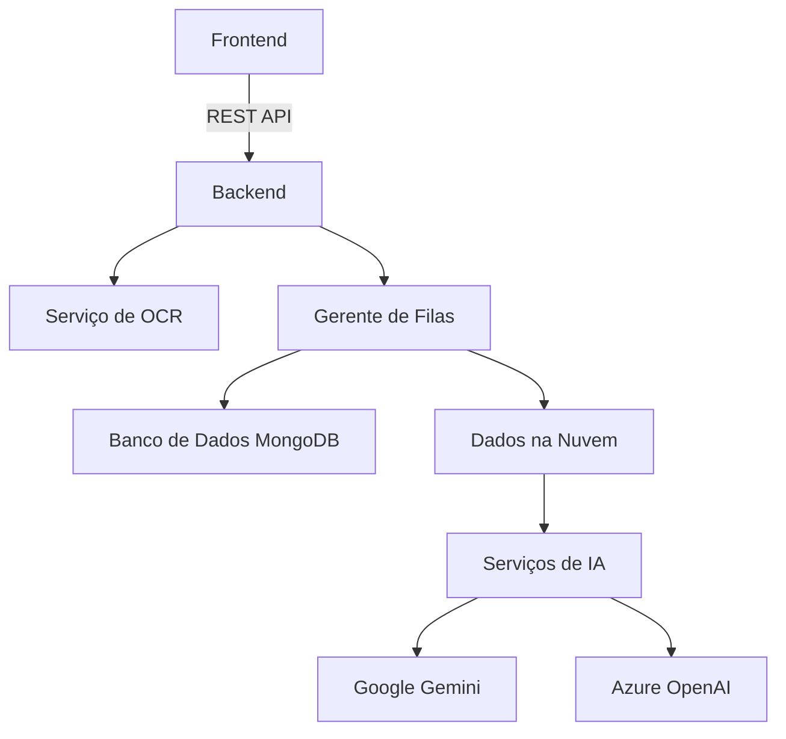

## Visão Geral Detalhada
**Contexto**: O projeto RAG-MPMG é um pipeline de Recuperação Aumentada de Geração (RAG) para normas internas do Ministério Público de Minas Gerais (MPMG). Seu propósito é processar documentos como PDFs e DOCXs, realizar OCR, extração de metadados e permitir a busca e recuperação de informações a partir desses documentos.

**Regras de Negócio**: O sistema permite operações de OCR em documentos, a normalização dos dados extraídos, a vetorização e a indexação, utilizando FAISS para buscas eficientes. Além disso, a solução integra um sistema de gerenciamento de filas via Redis para processar as tarefas de forma assíncrona.

## Tecnologias e Versões
- **FastAPI**: 0.115.14
- **Ray**: 2.47.1
- **PyMuPDF**: 1.26.1
- **Surya OCR**: 0.14.6
- **FAISS**: 1.13.2
- **MongoDB**: 6.1.0+
- **Azure OpenAI Client**: 1.93.0
- **Redis**: 6.4.0

## Arquitetura do Sistema
A arquitetura do sistema é composta pelas seguintes camadas: 

**Camada de Frontend**: A interação com o usuário é feita através de endpoints REST, onde as requisições são manipuladas pelo FastAPI. 

**Camada de Backend**: O backbone do sistema que processa as requisições, inclui serviços voltados para OCR e gerenciamento de filas.

**Serviço de OCR**: Implementa o processamento de OCR com suporte a múltiplos formatos e faz uso do Surya para reconhecimento de texto.

**Gerente de Filas**: Implementa um sistema de gerenciamento de filas utilizando o Redis, que publica tarefas para processamento assíncrono.

**Banco de Dados MongoDB**: Utilizado para armazenar as informações extraídas e processadas dos documentos, além de manter o histórico das tarefas executadas.

**Dados na Nuvem e Serviços de IA**: Integrações com serviços de AI para geração e análise de textos.

## ANÁLISE DE CÓDIGO
### main.py
**Propósito**: Ponto de entrada do aplicativo FastAPI.

**Classes principais**: 
- `FastAPI`: Instância principal do aplicativo.

**Métodos principais**:
- `load_dotenv()`: Carrega variáveis de ambiente do arquivo .env para configuração da aplicação.
- `include_router(v1_router)`: Integra as rotas da API na aplicação.

---

### app/api/v1.py
**Propósito**: Define as rotas de versão 1 da API.

**Classes principais**:
- `APIRouter`: Para gerenciar as rotas.
- `StandardResponse`: Classe do modelo de resposta padrão.

**Métodos principais**:
- `root()`: Endpoint principal que retorna uma mensagem de sucesso.
- `gerar_minuta_endpoint(id)`: Gera um modelo a partir do ID fornecido.
  - **Entradas**: id (str) - ID do modelo a ser gerado.
  - **Saídas**: JSON com o job_id.

---

### app/core/config.py
**Propósito**: Configuração central para o aplicativo, laborando variáveis ambientais e definindo configurações necessárias para a operação. 

**Métodos principais**:
- `__init__`: Carrega as variáveis a partir do ambiente e as inicializa.
- `get_ray_runtime_env()`: Cria um ambiente de execução para Ray, através de dependências do requirements.txt.
  - **Saídas**: Objeto `RuntimeEnv` necessário para inicializar tarefas em Ray.

---

### app/core/queue.py
**Propósito**: Gerenciamento das filas utilizando Redis.

**Classes principais**:
- `QueueManager`: Gerencia as interações com Redis relacionadas a filas.

**Métodos principais**:
- `enqueue_task(data, queue)`: Adiciona uma tarefa à fila com o ID único gerado, e salva o status como "pending".
  - **Entradas**: data (dict) - Dados da tarefa, queue (str) - Nome da fila.
  - **Saídas**: ID da tarefa.
- `get_job_status(job_id)`: Retorna o status de um job específico.
  - **Entradas**: job_id (str) - ID do job.
  - **Saídas**: Status do job ou None.

---

### app/services/gpt_service.py
**Propósito**: Contém a lógica de geração e análise de respostas usando serviços GPT.

**Métodos principais**:
- `gerar_resposta_gpt(data_geracao_gpt)`: Gera uma resposta a partir de dados de entrada que corresponde a um documento "inteligência".
  - **Entradas**: data_geracao_gpt (DataGeracaoGptDTO) - Dados necessários para gerar resposta.
  - **Saídas**: Dicionário com o identificador do documento gerado.

## Fluxos de Dados Completo
O fluxo de dados típico começa quando um usuário faz uma requisição à API, que passa pela seguinte sequência:
1. A requisição é recebida e processada pelo FastAPI em `main.py`.
2. O router v1 em `app/api/v1.py` mapeia a chamada para o método apropriado.
3. As operações de OCR são geridas através do serviço em `ocr_service.py`, onde o documento é processado e convertido em texto.
4. Os dados são armazenados no MongoDB através do repositório definido em `repositories/inteligencia_repository.py`.
5. O status das tarefas é gerido via Redis, permitindo seguimiento e atualização do status da requisição.

Essa descrição fornece um panorama do funcionamento da aplicação e suas componentes principais, permitindo uma boa compreensão da funcionalidade e estrutura do sistema.