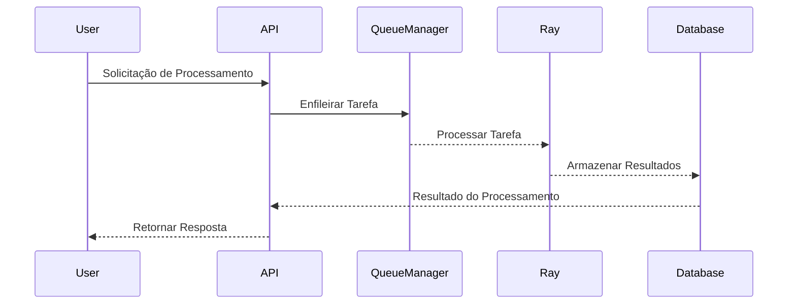

# Documentação Técnica do Projeto RAG-MPMG

## Visão Geral

O projeto RAG-MPMG é uma solução avançada para processamento de documentos e busca vetorial, desenvolvida para atender às necessidades do Ministério Público de Minas Gerais (MPMG). Utilizando uma arquitetura baseada em microserviços, o sistema integra tecnologias de ponta como FastAPI, Ray, e bibliotecas especializadas em inteligência artificial e manipulação de documentos. O objetivo principal do projeto é automatizar e otimizar o processamento de normas internas, garantindo eficiência e precisão.

## Tecnologias

### FastAPI
FastAPI é um framework moderno para construção de APIs em Python, conhecido por sua alta performance e facilidade de uso. Ele permite a criação de APIs rápidas e eficientes, com suporte nativo para validação de dados e geração automática de documentação.

### Ray
Ray é uma biblioteca para computação distribuída, projetada para executar tarefas em paralelo, aproveitando ao máximo os recursos de hardware disponíveis. No projeto RAG-MPMG, Ray é utilizado para gerenciar tarefas de processamento intensivo, garantindo escalabilidade e eficiência.

### Surya OCR
Surya OCR é uma ferramenta especializada em reconhecimento óptico de caracteres, utilizada para extrair texto de documentos digitalizados. Esta tecnologia é fundamental para converter documentos físicos em dados digitais pesquisáveis.

### FAISS
FAISS (Facebook AI Similarity Search) é uma biblioteca para busca e indexação vetorial, otimizada para grandes volumes de dados. Ela permite realizar buscas rápidas e precisas em coleções de vetores, essencial para a funcionalidade de busca vetorial do sistema.

### MongoDB e SQL Server
MongoDB é um banco de dados NoSQL utilizado para armazenamento de documentos, enquanto o SQL Server é utilizado para consultas estruturadas. A combinação dessas tecnologias permite flexibilidade e robustez no gerenciamento de dados.

### HDFS
O Hadoop Distributed File System (HDFS) é um sistema de arquivos distribuído que facilita o armazenamento de grandes volumes de dados. Ele é utilizado no projeto para garantir que os dados sejam armazenados de forma segura e acessível.

## Arquitetura

A arquitetura do projeto é modular e organizada em várias camadas, cada uma responsável por uma parte específica da aplicação:

1. **API**: A camada de API expõe os endpoints da aplicação, permitindo a interação com usuários e sistemas externos.
2. **Core**: Esta camada contém a configuração da aplicação, gerenciamento de filas e logging.
3. **Repositories**: Responsável pela interação com os bancos de dados, abstraindo a lógica de acesso a dados.
4. **Schemas**: Define os modelos de dados utilizados na aplicação, garantindo consistência e validação.
5. **Services**: Contém a lógica de negócios, incluindo o processamento de documentos e integração com serviços externos.
6. **Use Cases**: Implementa casos de uso específicos, encapsulando a lógica de interação entre as diferentes camadas.

## Contexto Teórico da Arquitetura

### Microserviços
A arquitetura de microserviços divide a aplicação em serviços menores e independentes, cada um responsável por uma funcionalidade específica. Isso facilita a escalabilidade e manutenção do sistema, permitindo que diferentes partes da aplicação sejam desenvolvidas e implantadas de forma independente.

### Computação Distribuída
A computação distribuída, implementada através do Ray, permite que tarefas sejam executadas em paralelo em múltiplos nós, aumentando a capacidade de processamento do sistema. Isso é particularmente útil para operações intensivas em dados, como o processamento de OCR.

### Busca Vetorial
A busca vetorial, facilitada pelo FAISS, é um método eficiente para encontrar similaridades em grandes conjuntos de dados. Ela é utilizada no projeto para permitir buscas rápidas e precisas em documentos processados.

## Análise de Código Detalhada

### Arquivo `main.py`

```python
from dotenv import load_dotenv
import ray
import fastapi
from app.api.v1 import router as v1_router
from app.core.config import Config

# Carregar variáveis do .env
load_dotenv()

config = Config()

app = fastapi.FastAPI(
    title="MP-IA",
    version=config.app_version,
    description="API - para processamento de Inteligência Artificial",
    openapi_url="/openapi.json",
    docs_url="/docs",
    redoc_url="/redoc",
)

app.include_router(v1_router)
```

#### Análise

- **Carregamento de Variáveis de Ambiente**: A biblioteca `dotenv` é usada para carregar variáveis de ambiente de um arquivo `.env`, permitindo que configurações sensíveis sejam gerenciadas de forma segura e flexível.
  
- **Configuração da Aplicação**: A instância do `FastAPI` é configurada com parâmetros como `title`, `version`, e `description`, essenciais para a documentação automática da API. Os endpoints de documentação são configurados para `/docs` e `/redoc`, facilitando o acesso à documentação interativa.

- **Inclusão de Rotas**: O roteador `v1_router` é incluído na aplicação, centralizando as rotas da versão 1 da API e garantindo uma estrutura organizada para a definição de endpoints.

### Arquivo `README.md`

O `README.md` oferece uma visão geral do projeto, incluindo funcionalidades, tecnologias, e instruções de instalação e execução. Este documento é crucial para desenvolvedores que desejam entender ou contribuir para o projeto, servindo como ponto de partida para novos colaboradores.

### Arquivo `requirements.txt`

Este arquivo lista todas as dependências do projeto, garantindo que o ambiente de desenvolvimento possa ser reproduzido de forma consistente. A especificação de versões exatas para cada biblioteca ajuda a evitar problemas de compatibilidade e facilita a manutenção do projeto.

### Arquivo `app/api/v1.py`

```python
from fastapi import APIRouter, Path, Body
from typing import Literal, Optional
from app.schemas.geral import StandardResponse
from app.core.logger import Logger
from app.core.queue import QueueManager, DEFAULT_QUEUE, HIGH_PRIORITY_QUEUE, LOW_PRIORITY_QUEUE
from app.usecases.queue_usecase import get_prioridade_task_minuta, get_prioridade_taks_documentos

router = APIRouter(
    prefix="/v1",
    tags=["v1"],
    responses={404: {"description": "Not found"}},
)

logger = Logger("app.api.v1")
logger.info("Iniciando API v1.")

queue_manager = QueueManager()
```

#### Análise

- **Roteador da API**: O `APIRouter` é configurado com um prefixo `/v1`, permitindo a versionamento das rotas. Isso é uma boa prática, pois facilita a manutenção e evolução da API ao longo do tempo.

- **Logger**: A instância de `Logger` é criada para registrar informações relevantes sobre a operação da API, essencial para monitoramento e depuração.

- **Gerenciador de Filas**: A classe `QueueManager` é instanciada, permitindo a manipulação de tarefas em filas, crucial para o processamento assíncrono e eficiente das requisições.

### Endpoints

Os endpoints definidos no arquivo `v1.py` incluem:

1. **GET /**: Retorna uma mensagem de "Hello World".
2. **GET /gerar-minuta/{id}**: Inicia o processamento de um modelo baseado no ID fornecido.
3. **GET /modificar-minuta/{id}**: Modifica um modelo existente.
4. **POST /ocr-documentos-processo**: Inicia o processamento de OCR para documentos de processo.
5. **GET /queue/status/{job_id}**: Retorna o status de um job específico.
6. **GET /queue/info**: Retorna informações sobre os jobs nas filas.

Cada endpoint é implementado com tratamento de exceções, garantindo que erros sejam registrados e mensagens apropriadas sejam retornadas ao usuário.

### Arquivo `app/core/config.py`

```python
import os
from ray.runtime_env import RuntimeEnv, RuntimeEnvConfig

class Config:
    def __init__(self):
        self.app_version = os.getenv("APP_VERSION", "1.0.0")
        self.mongo_uri = os.getenv("MONGO_URI")
        # ... (outras variáveis de configuração)

    def get_ray_runtime_env(self) -> RuntimeEnv:
        # Pega os requirements do arquivo requirements.txt
        with open("requirements.txt", "r") as f:
            pip_requirements = [line.strip() for line in f if line.strip() and not line.startswith("#")]

        return RuntimeEnv(
            pip=pip_requirements,
            config=RuntimeEnvConfig(
                setup_timeout_seconds=1800
            ),
            working_dir=".",
            env_vars={
                "MONGO_URI": self.mongo_uri,
                # ... (outras variáveis)
            }
        )
```

#### Análise

- **Classe de Configuração**: A classe `Config` centraliza a configuração da aplicação, permitindo que variáveis de ambiente sejam facilmente acessadas. Isso é uma boa prática, pois separa a lógica de configuração da lógica de aplicação.

- **Ambiente de Execução do Ray**: O método `get_ray_runtime_env` configura o ambiente de execução para o Ray, incluindo as dependências necessárias e variáveis de ambiente. Isso é fundamental para garantir que o processamento distribuído funcione corretamente.

### Arquivo `app/core/logger.py`

```python
import logging
import os
from logging.handlers import RotatingFileHandler
from app.core.config import Config

class Logger:
    def __init__(self, name: str, log_file_name: str = None):
        config = Config()
        # ... (configuração do logger)

    def debug(self, message: str):
        """Log de nível DEBUG"""
        self.logger.debug(message)

    # ... (outros métodos de log)
```

#### Análise

- **Logger Personalizado**: A classe `Logger` encapsula a configuração do logging, permitindo que diferentes partes da aplicação registrem mensagens de log de forma consistente. O uso de `RotatingFileHandler` garante que os logs não cresçam indefinidamente, mantendo um histórico gerenciável.

### Arquivo `app/core/queue.py`

```python
from redis import Redis
from redis.exceptions import RedisError
import json
import uuid
import time
from typing import Optional, Dict, Any, List, Tuple
from app.core.config import Config

class QueueManager:
    """Gerenciador de fila Redis para processamento Ray com suporte a múltiplas filas e prioridades"""
    
    def __init__(self):
        self.config = Config()
        self.redis_client = Redis(
            host=self.config.queue_redis_host,
            port=self.config.queue_redis_port,
            db=self.config.queue_redis_db
        )
    
    def enqueue_task(self, data: Dict[str, Any], queue: str = DEFAULT_QUEUE) -> str:
        """Adiciona uma tarefa à fila especificada com ID único"""
        # ... (implementação do método)
```

#### Análise

- **Gerenciador de Filas**: A classe `QueueManager` gerencia a interação com o Redis para enfileirar tarefas. Isso é crucial para o processamento assíncrono, permitindo que tarefas sejam adicionadas e processadas em segundo plano.

- **Método `enqueue_task`**: Este método adiciona uma tarefa à fila e gera um ID único para cada tarefa, garantindo que cada tarefa possa ser rastreada e gerenciada de forma eficiente.

### Arquivo `app/services/ocr_service.py`

```python
import fitz
from PIL import Image
from surya.recognition import RecognitionPredictor
from surya.detection import DetectionPredictor
from bs4 import BeautifulSoup
from docx import Document
import io

def ocr_documento_pdf(binario: bytes) -> str:    
    # ... (implementação do OCR para PDF)
```

#### Análise

- **Serviço de OCR**: O módulo `ocr_service.py` contém funções para realizar OCR em diferentes tipos de documentos (PDF, HTML, DOCX). A utilização de bibliotecas específicas para cada tipo de documento garante que o processamento seja eficiente e preciso.

- **Função `ocr_documento_pdf`**: Esta função utiliza a biblioteca `fitz` para abrir e processar documentos PDF, extraindo texto através de reconhecimento óptico. Isso é essencial para a funcionalidade principal do sistema, que é a transformação de documentos em conhecimento consultável.

## Fluxos de Dados

O fluxo de dados no sistema é organizado em várias etapas, garantindo que as operações sejam realizadas de forma eficiente e segura:

1. **Recepção de Solicitações**: O usuário faz uma requisição a um dos endpoints da API, iniciando o processo de interação com o sistema.
2. **Processamento de Tarefas**: Dependendo do endpoint, a requisição pode iniciar um processo de OCR, gerar uma minuta ou modificar um documento existente. As tarefas são enfileiradas utilizando o `QueueManager`.
3. **Execução Assíncrona**: As tarefas são processadas em segundo plano, utilizando o Ray para computação distribuída, se necessário. Isso garante que o sistema possa lidar com grandes volumes de dados de forma eficiente.
4. **Armazenamento de Resultados**: Os resultados do processamento são armazenados em um banco de dados MongoDB ou SQL Server, conforme apropriado, garantindo a persistência e integridade dos dados.
5. **Retorno de Respostas**: Após o processamento, o sistema retorna uma resposta ao usuário, informando o status da operação ou os resultados obtidos.



## Conclusão

O projeto RAG-MPMG representa uma solução robusta e bem estruturada para o processamento de documentos e busca vetorial. A utilização de tecnologias modernas, aliada a boas práticas de desenvolvimento, como a separação de responsabilidades e o uso de filas para processamento assíncrono, contribui para a eficiência e escalabilidade do sistema. A documentação e a organização do código são adequadas, facilitando a manutenção e evolução do projeto, além de garantir que ele atenda às necessidades do Ministério Público de Minas Gerais de forma eficaz.

(Aviso: Esta documentação atingiu o limite de refinamentos e pode conter imprecisões.)