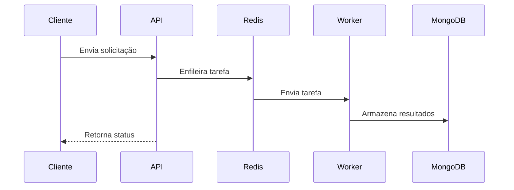

# Documentação Técnica Detalhada do Projeto RAG-MPMG

## Visão Geral

O projeto RAG-MPMG é uma aplicação destinada à implementação de um pipeline de RAG (Retrieval-Augmented Generation) para o processamento de documentos legais, com foco em normas internas do Ministério Público de Minas Gerais (MPMG). A aplicação é construída em torno de uma API desenvolvida com FastAPI, que permite a interação com os usuários para executar tarefas de processamento de documentos, incluindo OCR (Reconhecimento Óptico de Caracteres), extração de metadados, vetorização e busca vetorial.

## Tecnologias

O projeto incorpora diversas tecnologias modernas e eficientes:

- **FastAPI**: Framework para construção de APIs com Python, conhecido por sua velocidade e facilidade de uso.
- **Ray**: Biblioteca para computação distribuída, permitindo execução paralela de tarefas.
- **Surya OCR**: Ferramenta para reconhecimento óptico de caracteres.
- **FAISS**: Biblioteca para busca vetorial eficiente.
- **MongoDB**: Banco de dados NoSQL para armazenamento de documentos e metadados.
- **SQL Server**: Sistema de gerenciamento de banco de dados relacional.
- **HDFS**: Sistema de arquivos distribuído para armazenamento de grandes volumes de dados.

## Arquitetura

A arquitetura do projeto é modular e segue uma abordagem em camadas:

1. **API**: Camada de comunicação com o cliente, onde as rotas são definidas.
2. **Core**: Configurações da aplicação, gerenciamento de filas e logging.
3. **Repositories**: Acesso a dados, interações com bancos de dados.
4. **Services**: Lógica de negócios e implementação de funcionalidades específicas.
5. **Schemas**: Modelos de dados utilizados na aplicação.

### Estrutura do Projeto

A estrutura do projeto é organizada conforme abaixo:

```
RAG-MPMG/
|-- app/
|   |-- api/           # Rotas
|   |-- core/          # Configurações e utilitários
|   |-- repositories/  # Acesso a dados
|   |-- schemas/       # Modelos de dados
|   |-- services/      # Lógica de negócios
|   |-- usecases/      # Casos de uso
|   |-- workers/       # Workers do Ray
|-- RAG/               # Pipeline RAG
|-- static/            # Arquivos estáticos
|-- main.py            # Ponto de entrada da aplicação
|-- requirements.txt   # Dependências do projeto
|-- README.md          # Documentação do projeto
```

## Contexto Teórico da Arquitetura

### RAG (Retrieval-Augmented Generation)

RAG é uma técnica que combina a recuperação de informações com a geração de texto. Em vez de confiar apenas em modelos de linguagem para gerar respostas, o RAG primeiro recupera documentos relevantes de uma base de dados e, em seguida, utiliza esses documentos para gerar respostas mais precisas e contextualmente relevantes. Este método é particularmente útil para sistemas que precisam lidar com informações complexas e em grande escala, como é o caso dos documentos legais no projeto RAG-MPMG.

### Computação Distribuída com Ray

Ray é uma biblioteca que facilita a execução de tarefas em paralelo em um ambiente distribuído. Ele permite que a aplicação escale horizontalmente, utilizando múltiplos nós para processar tarefas simultaneamente. No contexto do RAG-MPMG, Ray é usado para distribuir tarefas de processamento de documentos, como OCR e vetorização, aumentando a eficiência e reduzindo o tempo de resposta.

### Busca Vetorial com FAISS

FAISS (Facebook AI Similarity Search) é uma biblioteca projetada para busca vetorial eficiente. Ela permite a indexação e busca de vetores de alta dimensão, o que é essencial para aplicações que lidam com dados não estruturados, como texto. No projeto RAG-MPMG, FAISS é usado para implementar a busca vetorial, facilitando a recuperação rápida de documentos relevantes com base em suas representações vetoriais.

## Análise de Código Detalhada

### 1. `main.py`

O arquivo `main.py` é o ponto de entrada da aplicação. Nele, as variáveis de ambiente são carregadas e a instância do FastAPI é criada e configurada.

```python
from dotenv import load_dotenv
import ray
import fastapi
from app.api.v1 import router as v1_router
from app.core.config import Config

# Carregar variáveis do .env
load_dotenv()

config = Config()

app = fastapi.FastAPI(
    title="MP-IA",
    version=config.app_version,
    description="API - para processamento de Inteligência Artificial",
    openapi_url="/openapi.json",
    docs_url="/docs",
    redoc_url="/redoc",
)

app.include_router(v1_router)
```

#### Análise

- **Carregamento de Variáveis de Ambiente**: O uso do `load_dotenv()` permite que a aplicação carregue configurações sensíveis, como credenciais de banco de dados, a partir de um arquivo `.env`.
- **Instância do FastAPI**: A instância `app` é configurada com metadados como título, versão e descrição, além de definir URLs para a documentação da API.
- **Inclusão de Rotas**: O roteador `v1_router` é incluído, que contém as definições das rotas da API.

### 2. `README.md`

O arquivo `README.md` fornece uma visão geral do projeto, incluindo informações sobre instalação, execução e descrição das funcionalidades.

#### Análise

- **Estrutura Clara**: O README é bem estruturado, apresentando seções para instalação, configuração e execução da aplicação.
- **Pipeline RAG**: A descrição do pipeline RAG é clara e detalha as etapas do processamento de documentos, desde a coleta até a síntese de respostas.
- **Tecnologias Utilizadas**: A lista de tecnologias é abrangente, permitindo que novos desenvolvedores entendam rapidamente as ferramentas envolvidas.

### 3. `app/api/v1.py`

Este arquivo define as rotas da API, incluindo endpoints para gerar e modificar minutas, realizar OCR em documentos e consultar o status de jobs.

#### Análise

- **Definição de Rotas**: As rotas são definidas utilizando o `APIRouter` do FastAPI, o que permite uma organização modular das rotas.
- **Tratamento de Erros**: Cada endpoint possui tratamento de exceções, registrando erros e retornando respostas apropriadas ao cliente.
- **Uso de Pydantic**: O uso de `StandardResponse` como modelo de resposta padronizada facilita a consistência nas respostas da API.

### 4. `app/core/config.py`

Este arquivo contém a classe `Config`, que gerencia as configurações da aplicação, carregando valores do ambiente.

#### Análise

- **Gerenciamento de Configurações**: A classe `Config` centraliza a configuração da aplicação, permitindo fácil acesso a variáveis de ambiente.
- **Métodos de Configuração do Ray**: Os métodos `get_ray_runtime_env` e `get_ray_config` configuram o ambiente de execução do Ray, permitindo que a aplicação utilize computação distribuída.

### 5. `app/core/logger.py`

Este arquivo implementa a classe `Logger`, que gerencia o logging da aplicação.

#### Análise

- **Rotação de Logs**: O uso de `RotatingFileHandler` permite que os logs sejam gerenciados de forma eficiente, evitando que arquivos de log cresçam indefinidamente.
- **Níveis de Log**: A classe permite diferentes níveis de log (DEBUG, INFO, WARNING, ERROR, CRITICAL), facilitando o rastreamento e a depuração da aplicação.

### 6. `app/core/queue.py`

Este arquivo implementa a classe `QueueManager`, que gerencia a fila de tarefas utilizando Redis.

#### Análise

- **Gerenciamento de Filas**: A classe permite enfileirar tarefas, consultar status e obter estatísticas sobre as filas, facilitando o processamento assíncrono de tarefas.
- **Persistência de Status**: O uso do Redis para armazenar o status das tarefas garante que a aplicação possa recuperar informações sobre jobs mesmo após reinicializações.

### 7. `app/services/ocr_service.py`

Este arquivo contém funções para realizar OCR em diferentes tipos de documentos.

#### Análise

- **Suporte a Vários Formatos**: As funções `ocr_documento_pdf`, `ocr_documento_html` e `ocr_documento_docx` demonstram a flexibilidade do serviço, permitindo o processamento de diferentes formatos de documentos.
- **Uso de Bibliotecas**: A utilização de bibliotecas como `fitz` para PDF e `BeautifulSoup` para HTML mostra uma abordagem prática e eficiente para extração de texto.

### 8. `app/usecases/inteligencia_usecase.py`

Este arquivo contém a lógica de negócios relacionada ao processamento de documentos de inteligência.

#### Análise

- **Processamento de Documentos**: As funções implementadas realizam o processamento de documentos, incluindo a extração de texto e a atualização de registros no banco de dados.
- **Validação de OCR**: A função `validar_ocrs` garante que a taxa de falha no OCR esteja dentro de limites aceitáveis, aumentando a robustez do sistema.

## Fluxos de Dados

O fluxo de dados no sistema pode ser descrito da seguinte forma:

1. **Recepção de Solicitações**: O cliente envia uma solicitação para a API.
2. **Processamento de Tarefas**: A API enfileira a tarefa correspondente no Redis, utilizando o `QueueManager`.
3. **Execução de Tarefas**: Os workers do Ray processam as tarefas em paralelo, realizando operações como OCR e extração de metadados.
4. **Armazenamento de Resultados**: Os resultados são armazenados no MongoDB ou em outros bancos de dados conforme necessário.
5. **Retorno de Respostas**: A API retorna uma resposta ao cliente, informando o status da operação.



## Conclusão

A análise do projeto RAG-MPMG revela uma aplicação bem estruturada e modular, utilizando tecnologias modernas para o processamento de documentos legais. A implementação de boas práticas de programação, como tratamento de erros, logging e gerenciamento de configurações, contribui para a robustez e manutenibilidade do sistema. A documentação técnica é clara e abrangente, facilitando a compreensão e o desenvolvimento contínuo do projeto.

(Aviso: Esta documentação atingiu o limite de refinamentos e pode conter imprecisões.)