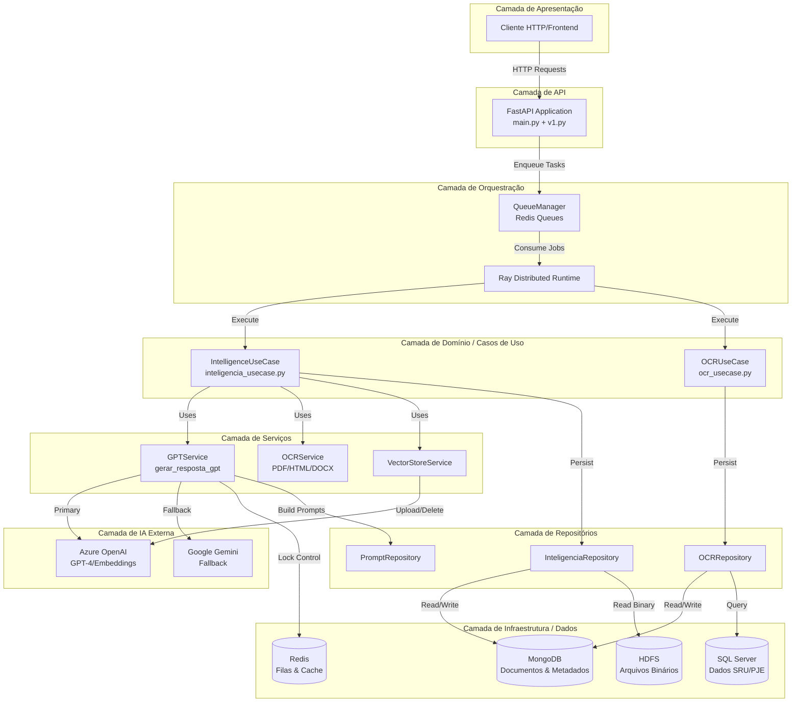
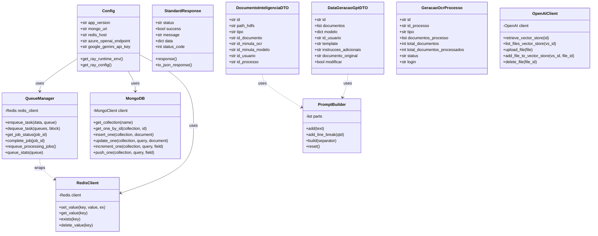
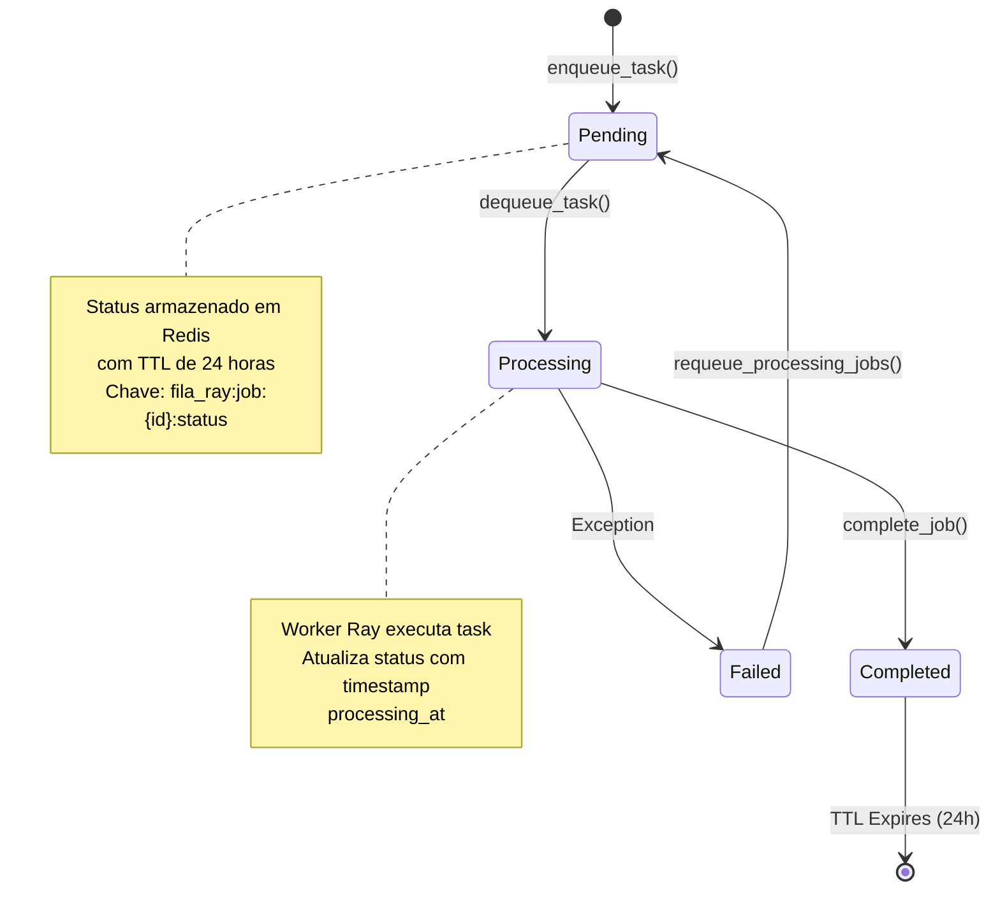
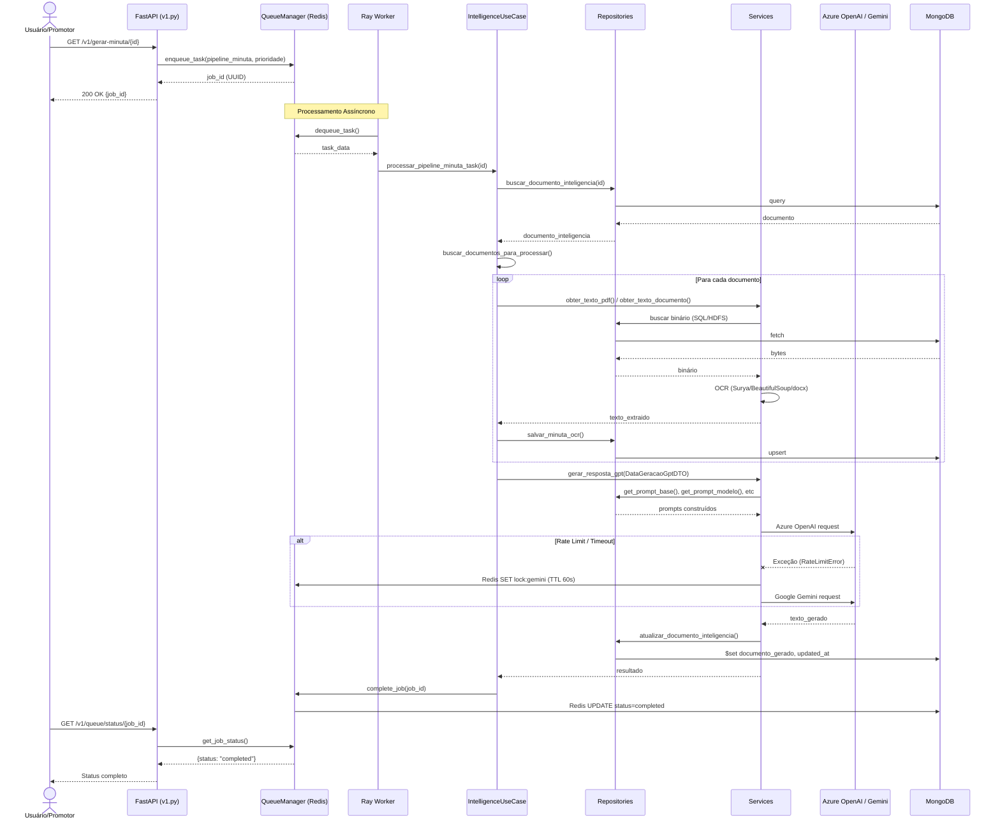
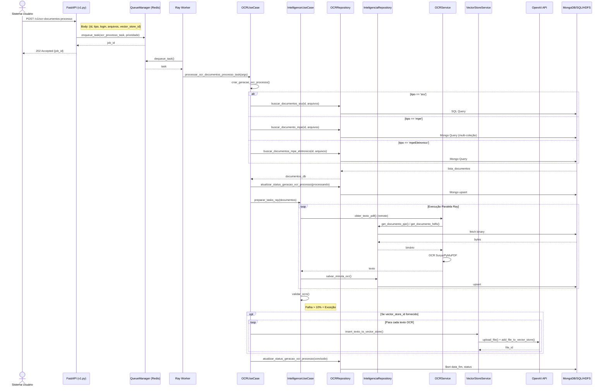
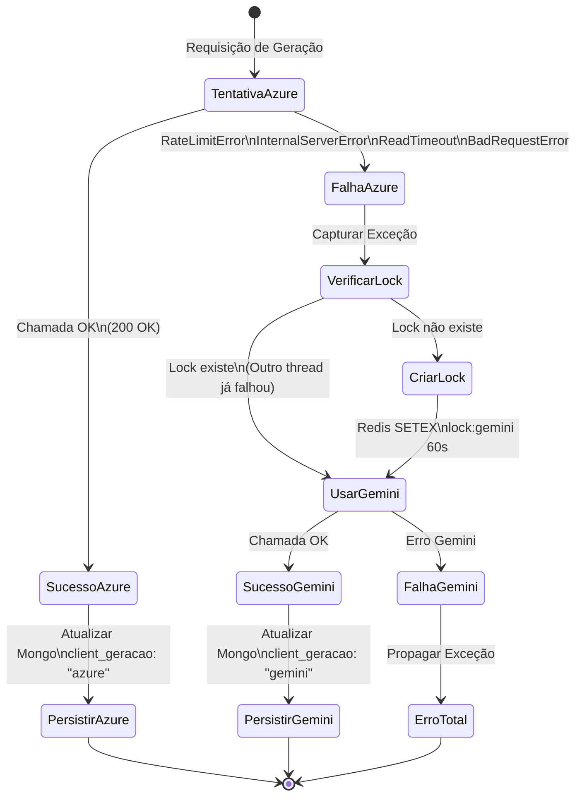

 # Documentação Técnica Exaustiva: Sistema RAG-MPMG

## 1. Visão Geral Executiva

O **RAG-MPMG** é uma plataforma de Inteligência Artificial Jurídica desenvolvida para o Ministério Público de Minas Gerais (MPMG), implementando o padrão arquitetural **RAG (Retrieval-Augmented Generation)** para processamento, análise e geração de documentos jurídicos. 

Em termos acessíveis: imagine um assistente jurídico extremamente eficiente que, antes de responder qualquer pergunta ou redigir uma minuta, consulta milhares de documentos processuais (processos, denúncias, arquivamentos) para basear suas respostas em fatos reais e legislação aplicável. Este sistema é o "cérebro" digital que permite que promotores de justiça gerem minutas jurídicas, analisem documentos processuais e conversem com seus processos através de linguagem natural.

### 1.1. Propósito e Escopo

O sistema atua em três frentes principais:
1. **Geração Inteligente de Minutas**: Criação automática de denúncias, arquivamentos e representações baseadas em documentos processuais existentes
2. **Processamento OCR em Lote**: Extração de texto de documentos PDF, HTML e DOCX provenientes de diferentes fontes (SRU - Sistema de Registro Único, MPE - Ministério Público Eletrônico, e documentos eletrônicos diversos)
3. **Modificação Contextual de Documentos**: Revisão e adaptação de minutas existentes com base em instruções específicas do usuário, mantendo o contexto jurídico original

### 1.2. Características Arquiteturais Distintivas

- **Resiliência Multi-Cloud**: Implementa mecanismo de fallback automático entre Azure OpenAI e Google Gemini, com controle de concorrência via locks distribuídos em Redis
- **Processamento Distribuído**: Utiliza Ray para paralelização de tarefas de OCR em múltiplos nós computacionais
- **Arquitetura Híbrida de Persistência**: Combina MongoDB (documentos estruturados), SQL Server (dados processuais legados) e HDFS (arquivos binários em escala)
- **Gestão de Filas Prioritárias**: Sistema de enfileiramento em Redis com três níveis de prioridade (high/default/low) e rastreamento completo do ciclo de vida dos jobs

---

## 2. Contexto Teórico da Arquitetura

Antes de mergulharmos na implementação específica, é fundamental compreender os padrões arquiteturais e tecnologias que fundamentam este sistema. Esta seção estabelece o vocabulário técnico necessário para entender as decisões de design.

### 2.1. RAG (Retrieval-Augmented Generation)

**Conceito Teórico**: RAG é uma arquitetura de IA que combina recuperação de informações (Information Retrieval) com geração de linguagem natural. Em vez de um modelo de linguagem (LLM) responder baseado apenas em seu conhecimento prévio treinado, o sistema primeiro "busca" documentos relevantes em uma base de conhecimento e depois gera a resposta fundamentada nesses documentos.

**Aplicação no Código**: 
- A classe `VectorStoreService` gerencia a indexação de textos OCR em vector stores (bancos vetoriais) da OpenAI
- O `PromptBuilder` (em `inteligencia_schema.py`) constrói contextos ricos concatenando textos de documentos recuperados antes de enviar ao LLM
- O fluxo `/gerar-minuta` exemplifica o padrão: recupera documentos do processo → extrai texto via OCR → indexa em vector store (opcional) → constrói prompt com contexto → gera minuta

### 2.2. Vector Stores e Embeddings

**Conceito Teórico**: Um vector store armazena representações matemáticas (embeddings) de textos em espaços multidimensionais (tipicamente 1536 dimensões). Textos semanticamente similares ficam próximos neste espaço vetorial, permitindo busca por similaridade (similarity search) além da busca por palavras-chave exatas.

**Aplicação no Código**:
- `OpenAIClient` gerencia vector stores via API compatível com OpenAI (`/v1/vector_stores`)
- Função `insert_texto_to_vector_store` converte texto em arquivo .txt e associa a um vector store para consulta semântica futura
- `remove_file_expired` implementa garbage collection de arquivos expirados nos vector stores, mantendo a higiene da base vetorial

### 2.3. Arquitetura em Camadas (Layered Architecture)

**Conceito Teórico**: Separação de responsabilidades em camadas horizontais: API (interface), Casos de Uso (orquestração), Serviços (lógica de domínio), Repositórios (acesso a dados) e Infraestrutura (conexões externas). Cada camada só pode conversar com a camada imediatamente inferior.

**Aplicação no Código**:
- **Camada de API** (`app/api/v1.py`): Apenas recebe HTTP requests e delega para filas
- **Camada de Casos de Uso** (`app/usecases/`): Orquestra múltiplos serviços (OCR, persistência, validação)
- **Camada de Serviços** (`app/services/`): Contém lógica pura de negócio (GPT, OCR)
- **Camada de Repositórios** (`app/repositories/`): Abstrai acesso a MongoDB, SQL Server, HDFS
- **Camada de Infraestrutura** (`app/core/`): Conexões com Redis, Mongo, configurações

### 2.4. Sistema de Filas e Processamento Assíncrono

**Conceito Teórico**: Em sistemas de IA, operações como OCR em PDFs pesados ou geração de texto via LLM são demoradas (10s a minutos). Um sistema síncrono (HTTP request-response) bloquearia o cliente. Filas de mensagens (message queues) desacoplam a requisição do processamento, permitindo execução assíncrona e resiliente.

**Aplicação no Código**:
- `QueueManager` implementa filas em Redis com múltiplas prioridades (high/default/low)
- Jobs são enfileirados via `enqueue_task` e consumidos por workers Ray via `dequeue_task`
- Status tracking completo: pending → processing → completed, com TTL (Time-To-Live) de 24h

### 2.5. OCR (Optical Character Recognition) e Processamento de Documentos

**Conceito Teórico**: OCR é a tecnologia que converte imagens de texto (escaneados ou PDFs nativos) em texto editável. Modelos modernos como Surya utilizam deep learning (redes neurais convolucionais + transformers) para reconhecimento de layout e texto.

**Aplicação no Código**:
- `ocr_service.py` encapsula Surya OCR para PDFs (conversão página-a-página em imagens 300 DPI)
- Suporte multi-formato: PyMuPDF (PDF), BeautifulSoup (HTML), python-docx (Word)
- Pipeline de validação: tolerância máxima de 10% de falhas em lotes de OCR (`validar_ocrs`)

---

## 3. Arquitetura do Sistema

### 3.1. Diagrama de Componentes de Alto Nível



### 3.2. Diagrama de Classes da Arquitetura de Domínio



### 3.3. Diagrama de Estados do Ciclo de Vida de um Job



---

## 4. Análise Detalhada da Implementação

### 4.1. Camada de API e Entrada (`main.py` e `app/api/v1.py`)

A camada de API é implementada utilizando **FastAPI**, framework Python de alta performance para construção de APIs REST. Esta camada é deliberadamente "magra" (thin layer), contendo apenas a definição de rotas, validação de parâmetros via Pydantic e delegação imediata para o sistema de filas.

#### 4.1.1. Ponto de Entrada Principal (`main.py`)

```python
from dotenv import load_dotenv
import ray
import fastapi
from app.api.v1 import router as v1_router
from app.core.config import Config

load_dotenv()
config = Config()

app = fastapi.FastAPI(
    title="MP-IA",
    version=config.app_version,
    description="API - para processamento de Inteligência Artificial",
    openapi_url="/openapi.json",
    docs_url="/docs",
    redoc_url="/redoc",
)

app.include_router(v1_router)
```

**Análise Técnica Detalhada**:
- **Inicialização de Configuração**: `load_dotenv()` carrega variáveis de ambiente do arquivo `.env` para o ambiente de execução Python antes de qualquer outra importação que possa depender dessas variáveis
- **Instanciação de Config**: `Config()` é instanciado uma única vez (padrão Singleton implícito) e reutilizado em toda a aplicação via importação de módulo
- **Metadados da API**: O objeto `FastAPI` é configurado com documentação automática (OpenAPI/Swagger) acessível em `/docs` (Swagger UI) e `/redoc` (ReDoc)
- **Inclusão de Rotas**: O router da versão 1 (`v1_router`) é montado com prefixo implícito definido no próprio router

#### 4.1.2. Router da API v1 (`app/api/v1.py`)

Este módulo define os endpoints REST expostos ao mundo exterior e implementa o padrão **API Gateway** para o sistema de filas.

**Definição do Router e Componentes Globais**:

```python
router = APIRouter(
    prefix="/v1",
    tags=["v1"],
    responses={404: {"description": "Not found"}},
)

logger = Logger("app.api.v1")
logger.info("Iniciando API v1.")

queue_manager = QueueManager()
```

**Endpoints Implementados**:

1. **Endpoint de Health Check** (`GET /v1/`):
   - Retorna `StandardResponse` com mensagem "Hello World"
   - Utilizado para verificação de saúde da aplicação

2. **Geração de Minuta** (`GET /v1/gerar-minuta/{id}`):
   - **Parâmetro**: `id` (path parameter) - identificador do modelo de minuta a ser gerado
   - **Lógica**: 
     - Determina prioridade via `get_prioridade_task_minuta(id)` (função externa não detalhada no trecho, mas inferida como heurística de negócio)
     - Constrói payload de task: `{"task": "processar_pipeline_minuta_task", "args": (id,)}`
     - Enfileira via `queue_manager.enqueue_task(payload, prioridade)`
     - Retorna `job_id` UUID ao cliente imediatamente (padrão Asynchronous Request-Reply)
   - **Tratamento de Erros**: Captura exceções genéricas, loga erro e retorna HTTP 500

3. **Modificação de Minuta** (`GET /v1/modificar-minuta/{id}`):
   - Similar ao endpoint de geração, porém passa argumento adicional `True` na tupla de args: `(id, True)`
   - Este booleano sinaliza ao worker que deve executar o pipeline de modificação ao invés de geração do zero

4. **OCR de Documentos de Processo** (`POST /v1/ocr-documentos-processo`):
   - **Parâmetros do Body**:
     - `id`: identificador do processo judicial
     - `tipo`: enum literal `['sru', 'mpe', 'mpeEletronico']` - determina a fonte dos documentos
     - `login`: identificação do usuário requisitante
     - `arquivos`: lista opcional de IDs específicos de documentos (filtragem)
     - `vector_store_id`: opcional, para indexação imediata em vector store após OCR
   - **Lógica de Priorização**: Calcula prioridade baseada na quantidade de arquivos (`get_prioridade_taks_documentos(len(arquivos))`)
   - **Payload**: `{"task": "processar_ocr_documentos_processo_task", "args": (id, tipo, login, arquivos, vector_store_id)}`

5. **Consulta de Status de Job** (`GET /v1/queue/status/{job_id}`):
   - Consulta status em tempo real no Redis via `queue_manager.get_job_status(job_id)`
   - Retorna dicionário completo do status ou `null` se não encontrado

6. **Estatísticas de Filas** (`GET /v1/queue/info`):
   - Agrega estatísticas das três filas (high, default, low) via `queue_stats()`
   - Retorna métricas de throughput, tempos médios de espera e processamento

### 4.2. Camada de Infraestrutura e Configuração

#### 4.2.1. Configuração Centralizada (`app/core/config.py`)

A classe `Config` implementa o padrão **Configuration as Code**, centralizando todas as variáveis de ambiente e parâmetros de sistema.

**Atributos Principais**:
- **Metadados**: `app_version` (default "1.0.0")
- **Conexões MongoDB**: `mongo_uri`, `mongo_db` (principal), `mongo_db_mpe` (base específica do MPE)
- **Conexões HDFS**: `hdfs_uri`, `hdfs_user`, `hdfs_password` (autenticação básica HTTP)
- **SQL Server**: `sql_server_url`, `sql_server_username`, `sql_server_password`, `sql_server_database`
- **Redis**: 
  - Aplicação: `redis_host`, `redis_port`, `redis_db`
  - Filas: `queue_redis_host`, `queue_redis_port`, `queue_redis_db` (permitindo separação física)
- **Azure OpenAI**: `azure_openai_endpoint`, `azure_openai_api_key`, `azure_openai_api_version`, `azure_openai_deployment`
- **Google Gemini**: `google_gemini_api_key`, `google_gemini_model`
- **Configuração de Filas**: `queue_num_threads`, thresholds de prioridade
- **Logging**: `log_dir`, `log_level`, `log_max_mb`, `log_backup_count`
- **Estratégia de IA**: `client_ia` (valores: "default", "gemini", "ignore")

**Métodos Críticos**:

`get_ray_runtime_env()`:
- Lê `requirements.txt` do projeto
- Constrói objeto `RuntimeEnv` do Ray com:
  - `pip`: lista de dependências garantindo que workers remotos tenham os mesmos pacotes
  - `config`: timeout de setup de 1800 segundos (30 minutos) para instalação de pacotes
  - `working_dir`: diretório raiz do projeto
  - `env_vars`: replicação de variáveis críticas de ambiente (credenciais de BD, tokens de API, etc.)

`get_ray_config()`:
- Retorna dicionário de configuração para `ray.init()`
- Inclui `ignore_reinit_error` para permitir hot-reloads em desenvolvimento
- Configura níveis de logging condicionais

#### 4.2.2. Sistema de Logging (`app/core/logger.py`)

Implementa logging estruturado com rotação automática de arquivos.

**Classe `Logger`**:
- **Inicialização**: 
  - Cria diretório de logs se inexistente (`os.makedirs`)
  - Configura `RotatingFileHandler` com `maxBytes` calculado como `1024 * 1024 * config.log_max_mb` (conversão para bytes)
  - Formato detalhado: `'%(asctime)s [%(levelname)s] %(name)s: %(message)s'`
- **Prevenção de Duplicação**: Verifica `if not self.logger.handlers:` antes de adicionar handlers, evitando logs duplicados em reimports
- **Níveis**: DEBUG, INFO, WARNING, ERROR, CRITICAL, EXCEPTION

**Função `init_logger_ray()`**:
- Configura logger específico para o runtime Ray (`"ray"`)
- Arquivo separado `ray.log` para isolamento de logs do framework distribuído

#### 4.2.3. Gerenciamento de Filas (`app/core/queue.py`)

Implementação de **Message Queue** customizada sobre Redis, com suporte a múltiplas prioridades e tracking de estado.

**Constantes e Configurações**:
```python
QUEUE_PREFIX = "fila_ray"
JOB_STATUS_EXPIRATION = 86400  # 24 horas em segundos
STATUS_PENDING = "pending"
STATUS_PROCESSING = "processing"
STATUS_COMPLETED = "completed"
DEFAULT_QUEUE = "default"
HIGH_PRIORITY_QUEUE = "high"
LOW_PRIORITY_QUEUE = "low"
```

**Classe `QueueManager`**:

*Método `enqueue_task(data: Dict[str, Any], queue: str = DEFAULT_QUEUE) -> str`*:
1. Gera `job_id` UUID se não fornecido no payload
2. Serializa `data` para JSON
3. Armazena metadados do job em Redis (hash) com chave `fila_ray:job:{job_id}:status`:
   - `status`: "pending"
   - `enqueue_at`: timestamp ISO
   - `queue`: nome da fila
   - `data_raw`: payload JSON original (para reprocessamento em caso de falha)
4. Empurra (RPUSH) o payload JSON na lista Redis `fila_ray:{queue}`
5. Retorna `job_id`

*Método `dequeue_task(queues=None, block=True, timeout=5) -> Tuple[str, Dict]`*:
1. Converte nomes de filas em chaves Redis completas (`fila_ray:{queue}`)
2. Se `block=True`: utiliza `BLPOP` (Blocking Left Pop) que aguarda até `timeout` segundos por elementos em qualquer uma das filas listadas (ordem define prioridade)
3. Se `block=False`: itera filas com `LPOP` não-bloqueante
4. Ao obter item:
   - Desserializa JSON
   - Atualiza status no Redis para "processing" com timestamp `processing_at`
   - Retorna tupla (nome_fila_original, dados_job)

*Método `_set_job_status(job_id, status, queue, data_raw=None)`*:
- Implementa upsert de status com TTL automático (24h)
- Preserva campos históricos (não sobrescreve timestamps anteriores)
- Estrutura de dados versionada por status:
  - `pending`: inclui `enqueue_at`, `data_raw`
  - `processing`: inclui `processing_at`
  - `completed`: inclui `completed_at`

*Método `queue_stats(queue: str = None) -> Dict`*:
- Varre todas as chaves `fila_ray:job:*:status` no Redis (usando SCAN implícito)
- Agrega métricas por fila:
  - Contadores: `pending`, `processing`, `completed`, `total`
  - Tempos: `avg_wait_time` (processing - enqueue), `avg_process_time` (completed - processing), `avg_time_elapsed` (completed - enqueue)
- Calcula tempos máximos e médias
- Permite filtragem por fila específica

*Método `requeue_processing_jobs() -> int`*:
- Recuperação de falhas (failover): varre jobs com status "processing"
- Re-enfileira jobs que possam ter sido perdidos devido a crash de workers
- Retorna contagem de jobs recuperados

#### 4.2.4. Utilitários (`app/core/utils.py`)

**Classe `DataHora`**:
- Wrapper sobre `datetime` para facilitar testes (permite injeção de data/hora mockada)
- Métodos: `now()`, `format(formato)`, `add_days(days)`, `remove_days(days)`

**Função `get_extensao_documento(path: str) -> str`**:
- Utiliza `os.path.splitext` para extração segura de extensão
- Converte para minúsculas para normalização

**Função `get_response_task_ray(task: ObjectRef) -> dict`**:
- Extrai metadados de uma referência de task Ray (`ObjectRef`)
- Retorna `task_id` e `job_id` em formato hexadecimal para rastreamento

### 4.3. Camada de Acesso a Dados (Data Access Layer)

#### 4.3.1. Wrapper MongoDB (`app/core/db/mongodb.py`)

**Classe `MongoDB`**:
- **Conexão**: Singleton por processo via `MongoClient` compartilhado
- **Métodos CRUD**:
  - `get_one_by_id(collection, id)`: converte string para `ObjectId` automaticamente
  - `get_one_by_query(collection, query)`: busca genérica por query dict
  - `get_many_by_query(collection, query)`: retorna lista de documentos
  - `insert_one(collection, document)`: inserção simples
  - `update_one(collection, query, document, options=None)`: suporta upsert e `$setOnInsert`
  - `delete_one(collection, query)` e `delete_many(collection, query)`
  - `unset_fields_one(collection, query, fields)`: remove campos específicos via `$unset`
  - `increment_one(collection, query, field)`: operação atômica `$inc`
  - `push_one(collection, query, field)`: adiciona a array via `$push`

**Tratamento de Exceções**: Todas as operações capturam exceções do PyMongo e re-lançam com mensagens contextualizadas, facilitando debugging.

#### 4.3.2. Cliente Redis (`app/core/db/redis.py`)

**Classe `RedisClient`**:
- Wrapper simplificado sobre `redis-py`
- Operações básicas: `set_value` (com TTL opcional), `get_value`, `exists`, `delete_value`
- Utilizado principalmente em `gpt_service.py` para implementação de locks distribuídos

#### 4.3.3. Cliente HDFS (`app/core/db/hdfs.py`)

**Classe `HDFS`**:
- Utiliza `hdfs.InsecureClient` (WebHDFS)
- Autenticação via `HTTPBasicAuth` com usuário/senha configurados
- Método `get_binary_file(path) -> bytes`: retorna conteúdo binário completo do arquivo

#### 4.3.4. Cliente OpenAI (`app/core/client/openai_client.py`)

**Classe `OpenAIClient`**:
- Inicializa cliente OpenAI com `base_url` apontando para endpoint Azure (`{endpoint}openai/v1/`)
- **Operações de Vector Store**:
  - `retrieve_vector_store(vector_store_id)`
  - `list_vector_stores(after, limit)`
  - `delete_vector_store(vector_store_id)`
- **Operações de Arquivos**:
  - `upload_file(file_obj)`: upload para OpenAI (não específico de vector store)
  - `list_files(purpose, after, limit)`
  - `retrieve_file(file_id)`
- **Associação Vector Store**:
  - `add_file_to_vector_store(vector_store_id, file_id)`
  - `delete_file_from_vector_store(vector_store_id, file_id)`
  - `list_files_vector_store(vector_store_id, after, limit)`

### 4.4. Camada de Repositórios (Repositories)

Esta camada implementa o padrão **Repository Pattern**, abstraindo a lógica de acesso a dados e permitindo que as camadas superiores operem em termos de objetos de domínio sem conhecimento dos detalhes de persistência.

#### 4.4.1. Repositório de Inteligência (`app/repositories/inteligencia_repository.py`)

**Funções de Documentos de Inteligência**:
- `buscar_documento_inteligencia(id)`: recupera documento gerado por ID na coleção `documentos_gerados_inteligencia`
- `atualizar_documento_inteligencia(id, documento, push=False)`: 
  - Se `push=True`: utiliza operação `$push` para adicionar a arrays (histórico de versões)
  - Se `push=False`: utiliza `$set` para atualização direta
- `atualizar_status_documento_inteligencia(data: AtualizarStatusMinutaDTO, status="processando")`:
  - Lógica complexa de atualização de subdocumentos baseada no estado:
    - Monta caminho dinâmico: `task_gerar` ou `task_modificar` baseado em `data.modificar`
    - Inclui subcampos: `task`, `data_inicio`, `data_fim`, `remote_tasks`, `erro`
  - Permite rastreamento completo do ciclo de vida da task (início, fim, erro)

**Funções de Minuta OCR**:
- `atualizar_minuta_ocr(id, documento)`: atualiza coleção `minuta_ocr_ia`
- `buscar_minuta_ocr_by_documento(id_documento)`: busca por campo `id_documento`
- `buscar_minutas_ocr_by_ids(ids)`: busca batch por lista de IDs
- `salvar_minuta_ocr(minuta_ocr: MinutaOCR)`:
  - Implementa upsert por `id_documento`
  - Em caso de inserção (`set_on_insert`), define `created_at` e flag `new=True`

**Funções de Modelos de Usuário**:
- `buscar_modelo_inteligencia(id)`: busca template de modelo por ID
- `buscar_modelo_minuta_usuario(id_usuario, modelo)`: busca modelo personalizado de usuário
- `salvar_modelo_minuta_usuario(documento, texto)`: persiste modelo customizado com upsert por `id_usuario` + `modelo`

**Funções de Documentos Binários**:
- `_documento_pje(id_documento, select)`: query SQL Server genérica
- `get_extensao_documento_pje(id_documento)`: inferência de extensão via MIME type
- `get_documento_pje(id_documento) -> DocumentoBinarioDTO`: retorna binário + extensão
- `get_documento_hdfs(path) -> DocumentoBinarioDTO`: retorna binário + extensão via HDFS

#### 4.4.2. Repositório de OCR (`app/repositories/ocr_repository.py`)

**Funções de Busca Multi-Fonte**:
- `buscar_documentos_sru(id_processo, ids_documentos=None)`:
  - Query SQL Server na tabela `ARQUIVO_DOCUMENTO_JUDICIAL_ELETRONICO`
  - Suporta filtragem por lista de IDs específicos (cláusula `IN`)
  - Retorna metadados (não o binário)

- `buscar_documento_mpe(id_processo, ids_documentos=None)`:
  - Consulta múltiplas coleções MongoDB (`documentos_feito`, `documentos_funcao`, etc.)
  - Filtra por `id_feito` (equivalente a id_processo)
  - Suporta filtro por `_id` específico

- `buscar_documentos_mpe_eletronico(id_processo, ids_documentos=None)`:
  - Coleção específica `documentos_eletronicos_processo`
  - Campo de filtro: `idProcesso` (tipo ObjectId)

**Funções de Gestão de Geração OCR**:
- `atualizar_documento_ocr(id, documento, push=False)`: atualização genérica em `geracao_ocr_processo`
- `atualizar_status_geracao_ocr_processo(data, status, total_documentos_processados=0)`:
  - Máquina de estados implementada via `match` (Python 3.10+ structural pattern matching):
    - `"processando"`: inicializa contadores, define task e data_inicio
    - `"incrementar"`: operação atômica `$inc` em `total_documentos_processados`
    - `"concluido"`: define `data_fim`
    - `"erro"`: registra mensagem de erro

#### 4.4.3. Repositório de Prompts (`app/repositories/prompt_retository.py`)

Centraliza a construção de prompts para LLMs, implementando técnicas de **Prompt Engineering** como Chain-of-Thought e Few-Shot Learning.

**Constantes de Exemplos**:
- `EXEMPLOS_DENUNCIA_COD`, `EXEMPLOS_ARQUIVAMENTO_COD`, `EXEMPLOS_REPRESENTACAO_COD`:
  - Listas de dicionários com `pergunta` e `resposta`
  - Demonstram raciocínio passo-a-passo (Chain-of-Thought) antes da conclusão final marcada com `#### Sim` ou `#### Não`

**Construtores de Prompt**:
- `get_prompt_base(data_geracao_gpt)`: 
  - Carrega template de arquivo físico (`static/templates/{template}.txt`)
  - Substitui placeholders (`%s` por data atual)
  - Anexa instruções de formatação HTML (`PROMPT_FORMATACAO_HTML`)

- `get_prompt_instrucoes_modelo(texto_modelo)`: 
  - Instrui o LLM a usar o modelo apenas como referência de estilo/estrutura, não copiando fatos

- `get_prompt_instrucoes_usuario(data_geracao_gpt)`:
  - Formata instruções adicionais do usuário com prefixos contextuais ("Sugestão do usuário:" vs "Instruções do usuário:")

- `get_prompt_documento_original(data_geracao_gpt)`:
  - Inclui texto original da minuta quando em modo de modificação

- `get_prompt_system_message(data_geracao_gpt)`:
  - Define o "persona" do assistente (analista jurídico vs jurista revisor)
  - Varia conforme `modificar` (True/False) e tipo de template

- `get_prompt_system_message_analise(data_geracao_gpt)`:
  - System message específico para análise de relevância de sugestões

- `get_prompt_analise(data_geracao_gpt, prompt_instrucoes_adicionais, prompt_documento_original)`:
  - Monta prompt completo para análise crítica da sugestão do usuário
  - Inclui exemplos de few-shot (`EXEMPLOS_ARQUIVAMENTO_COD`)

#### 4.4.4. Repositório de Vector Store (`app/repositories/vector_store_repository.py`)

Implementa **Pagination Pattern** para lidar com grandes volumes de dados na API OpenAI.

- `list_all_files_vector_store(vector_store_id, with_data=False)`:
  - Loop de paginação usando cursor `after`
  - Se `with_data=True`: faz fetch detalhado de cada arquivo (mais lento, mais dados)
  - Retorna lista acumulada de todos os arquivos

- `list_all_files()`: similar para files gerais (não associados a vector store)

- `list_all_vector_stores()`: paginação de vector stores (nota: código contém possível bug na lógica de indexação do cursor)

### 4.5. Camada de Schemas (Modelos de Dados)

Utiliza **Pydantic** para validação de dados, serialização e documentação automática (OpenAPI).

#### 4.5.1. Resposta Padrão (`app/schemas/geral.py`)

**Classe `StandardResponse`**:
- Campos: `status` (str), `success` (bool), `message` (str), `data` (dict), `error` (str), `status_code` (int)
- Método de classe `response(...)`: factory method que cria instância e converte para `JSONResponse` do FastAPI
- Lógica de inferência: se `status_code >= 400`, automaticamente ajusta `success=False` e `status="error"`

#### 4.5.2. Schemas de Inteligência (`app/schemas/inteligencia_schema.py`)

**Enumerações**:
- `Collection`: classe com atributos de classe definindo nomes de coleções MongoDB:
  - `DOCS_GERADOS = "documentos_gerados_inteligencia"`
  - `MODELOS_INTELIGENCIA = "modelos_inteligencia"`
  - `MODELO_MINUTA_USUARIO = "modelo_minuta_usuario"`
  - `MINUTAS_OCR = "minuta_ocr_ia"`
  - `CHATS_DOCUMENTAL = "chats_documental"`
  - `MENSAGENS_CHAT = "mensagens_chat_documental"`

**Modelos Pydantic**:
- `MinutaOCR`: `id_documento`, `id_documento_raw`, `id_processo`, `tipo`, `texto`
- `ModeloMinutaUsuario`: `id_usuario`, `modelo`, `texto_modelo`, `updated_at`

**Utilitário `PromptBuilder`**:
- Implementa padrão **Builder** para construção incremental de strings complexas
- Método `add(texto)`: retorna `self` (fluent interface/method chaining)
- Método `add_line_break(qtd=1)`: adiciona múltiplas quebras de linha
- Método `build(separador=" ")`: concatena partes inteligentemente (evita espaços duplos quando partes já terminam/iniciam com `\n`)
- Método `reset()`: limpa buffer para reuso

#### 4.5.3. Schemas de OCR (`app/schemas/ocr_schema.py`)

- `Collection`: define `DOCS_MPE` (lista de coleções), `DOCS_MPE_ELETRONICO`, `GERACAO_OCR_PROCESSO`
- `DocumentoOcr`: `id` (str), `path_hdfs` (str, default="")
- `GeracaoOcrProcesso`: modelo completo para tracking de jobs de OCR em lote, incluindo listas de `DocumentoOcr`, contadores de progresso, status e timestamps

#### 4.5.4. DTOs (`app/schemas/dto/inteligencia_dto.py`)

**`DocumentoInteligenciaDTO`**:
- Construtor customizado complexo que normaliza diferentes fontes de documentos:
  - Se `documento_referencia['ocr_processo'] == True`: trata como documento de OCR de processo (extrai `id_processo`, `id_geracao_ocr_processo`)
  - Caso contrário: extrai campos de documento de inteligência normal (`processo.id`, `usuario.id`, `modelo`, `_id`)
- Campos resultantes: `id`, `path_hdfs`, `tipo`, `id_documento`, `id_minuta_ocr`, `id_minuta_modelo`, `id_usuario`, `id_geracao_ocr_processo`, `modelo`, `id_processo`

**`DataGeracaoGptDTO`**:
- Construtor que filtra documentos do tipo 'modelo' da lista de entrada
- Separa o primeiro modelo encontrado para uso específico
- Extrai campos opcionais (`instrucoes_adicionais`, `documento_original`) do dicionário `documento_inteligencia`

**`TaskDTO`**: simples container para `task_id`, `task_name`, `job_id`

**`AtualizarStatusMinutaDTO`**: agregado para atualização de status, incluindo lista de `TaskDTO` para rastreamento de tasks Ray distribuídas

#### 4.5.5. Exceções (`app/schemas/exceptions/inteligencia_exceptions.py`)

- `ACQUIRE_LOCK_EXCEPTIONS`: tupla de exceções específicas da OpenAI que indicam condições transitórias (rate limit, timeout, erro interno) que justificam fallback para Gemini
- `LockAtivoException`: exceção customizada para indicar que o sistema está operando em modo Gemini devido a falha prévia no Azure

### 4.6. Camada de Serviços (Services)

Contém a lógica de negócio pura, independente de frameworks e infraestrutura.

#### 4.6.1. Serviço GPT (`app/services/gpt_service.py`)

Implementa **Strategy Pattern** para seleção de provedor de LLM com fallback automático.

**Função `_get_prompt_documentos(data_geracao_gpt)`**:
- Recupera textos OCR de documentos do processo via `buscar_minuta_ocr_by_documento`
- Concatena em `PromptBuilder` com prefixo "Documentos do processo:"

**Função `_get_prompt_modelo(data_geracao_gpt)`**:
- Busca modelo de minuta do usuário (personalização)
- Adiciona instruções de estilo ao prompt

**Função `_analise_sugestao_usuario(...)`**:
- Realiza pré-análise da sugestão do usuário usando Chain-of-Thought
- Verifica relevância e aplicabilidade antes de incorporar ao prompt principal

**Função `gerar_resposta_gpt(data_geracao_gpt) -> dict`**:
- **Montagem do Prompt**: 
  - Documentos OCR + Modelo + Instruções usuário + Documento original (se modificação) + Análise da sugestão
  - System message dinâmico baseado no tipo de operação
- **Lógica de Fallback**:
  1. Tenta Azure OpenAI (`AzureOpenAIClient`)
  2. Se exceção em `ACQUIRE_LOCK_EXCEPTIONS` (rate limit, timeout, etc.):
     - Verifica/cria lock em Redis (`key_lock = "lock:gemini:active"`) com TTL 60s
     - Registra no documento: `"client_geracao": "gemini"`
     - Chama `GoogleGeminiClient().get_response_text(...)`
  3. Se `LockAtivoException` (lock já existente): vai direto para Gemini
- **Persistência**: Atualiza documento em MongoDB com texto gerado e timestamp

#### 4.6.2. Serviço OCR (`app/services/ocr_service.py`)

Implementa **Adapter Pattern** para diferentes formatos de documento.

**`ocr_documento_pdf(binario: bytes) -> str`**:
- Utiliza **Surya OCR** (modelo de deep learning especializado em documentos)
- `DetectionPredictor`: localiza regiões de texto (bounding boxes)
- `RecognitionPredictor`: reconhece caracteres nas regiões detectadas
- Processamento página-a-página via PyMuPDF (fitz) a 300 DPI
- Concatenação de resultados com espaço como separador

**`ocr_documento_html(binario: bytes) -> str`**:
- BeautifulSoup4 parser 'html.parser'
- `get_text(separator=' ', strip=True)`: extrai texto visível, eliminando tags/scripts

**`ocr_documento_docx(binario: bytes) -> str`**:
- python-docx `Document` object
- Iteração sobre `document.paragraphs`, concatenando `paragraph.text`

#### 4.6.3. Serviço Vector Store (`app/services/vector_store_service.py`)

**`insert_texto_to_vector_store(texto, file_name, vector_store_id)`**:
- Cria arquivo em memória (`io.BytesIO`) com encoding UTF-8
- Define nome artificial `{file_name}.txt` (necessário para API OpenAI)
- Upload do arquivo (recebe `FileObject`)
- Associação ao vector store específico (`add_file_to_vector_store`)
- Retorna referência ao arquivo criado

**`remove_file_expired(logger)`**:
- **Garbage Collection**: Busca minutas OCR onde `store_openai.expires_at < datetime.now()`
- Para cada arquivo expirado:
  - Tenta deletar na API OpenAI (`delete_file`)
  - Se `NotFoundError`: já foi removido, apenas loga
  - Remove referência no MongoDB (`unset_fields_one` no campo `store_openai`)
- Prevenção de vazamento de recursos na nuvem

### 4.7. Camada de Casos de Uso (Use Cases)

Orquestra múltiplos serviços para realizar operações de negócio complexas.

#### 4.7.1. Caso de Uso de Inteligência (`app/usecases/inteligencia_usecase.py`)

**Função `_buscar_documento_binario(documento)`**:
- Roteamento por tipo: 'sru' → SQL Server, outros → HDFS

**Função `_salvar_texto_documento(documento, texto)`**:
- Normalização: texto vazio → "Nenhum texto encontrado"
- Se tipo em `['sru', 'mpe', 'mpeEletronico']`:
  - Cria/Atualiza `MinutaOCR` (upsert por `id_documento`)
  - Atualiza `documento.id_minuta_ocr` com ID persistido
- Se tipo 'modelo':
  - Salva em `modelo_minuta_usuario`
  - Atualiza `documento.id_minuta_modelo`

**Função `buscar_documentos_para_processar(documento)`**:
- **Normalização de Entrada**: Converte diferentes estruturas de entrada (documentos, arquivos, documentos_processo) em lista uniforme de `DocumentoInteligenciaDTO`
- Lógica de branching por tipo de entrada

**Função `obter_texto_pdf(documento)`**:
- Verificação de cache: se minuta OCR já existe, retorna imediatamente
- Caso contrário: busca binário → OCR → persistência

**Função `obter_texto_documento(documento)`**:
- Similar ao anterior, mas suporta múltiplos formatos (HTML, DOCX, etc.)
- Fallback para mensagem de formato não suportado

**Função `preparar_tasks_ray(documentos_processar, obter_texto_pdf_task, obter_texto_documento_task)`**:
- **Otimização de Lote**:
  - Separa documentos já processados (cache hit) dos pendentes
  - Para documentos pendentes, determina tipo de task Ray baseado na extensão
  - Retorna tupla: `(minutas_encontradas, remote_tasks)` para execução paralela

**Função `processar_resposta_ray(documento, funcao, ray_context)`**:
- Wrapper de execução com tratamento de exceções robusto
- Em caso de erro: captura traceback completo, atualiza documento pai (OCR processo ou documento inteligência) com warning detalhado
- Retorna `None` em caso de falha para ser filtrado posteriormente

**Função `validar_ocrs(ocrs)`**:
- **Circuit Breaker Pattern**: Calcula taxa de falha (`qtd_ocrs_nao_validos / total_ocrs`)
- Se taxa > 10%: lança exceção abortando o pipeline (prevenção de processamento com dados insuficientes)
- Retorna apenas OCRs válidos

**Função `remove_chats_expires(logger)`**:
- Manutenção de dados: remove chats documentais com mais de 30 dias (`remove_days(30)`)
- Deleta mensagens associadas (operação em cascada manual)
- **Nota**: Código atual processa apenas o primeiro chat encontrado (possível bug de implementação - deveria iterar completamente)

#### 4.7.2. Caso de Uso de OCR (`app/usecases/ocr_usecase.py`)

**Função `criar_geracao_ocr_processo(job_id, id, arquivos, tipo, login)`** (parcial):
- **Factory de Documentos**: Baseado no `tipo`, busca documentos em fontes diferentes:
  - 'sru': SQL Server (`buscar_documentos_sru`)
  - 'mpe': MongoDB MPE (`buscar_documento_mpe`), filtra por existência de `versaoPdf`
  - 'mpeEletronico': MongoDB (`buscar_documentos_mpe_eletronico`), filtra por `arquivo`
- **Normalização de IDs**: Prefixa IDs com tipo (`mpe:`, `mpeEletronico:`) para unicidade
- Constrói lista de `DocumentoOcr` para criação do agregado `GeracaoOcrProcesso`

---

## 5. Fluxos de Dados End-to-End

### 5.1. Fluxo de Geração de Minuta Jurídica



### 5.2. Fluxo de OCR em Lote de Processo Judicial



### 5.3. Fluxo de Fallback entre Provedores de IA



---

## 6. Considerações de Resiliência e Escalabilidade

### 6.1. Mecanismo de Circuit Breaker e Fallback

O sistema implementa um sofisticado mecanismo de **fallback** entre provedores de LLM:

1. **Tentativa Primária**: Sempre tenta Azure OpenAI primeiro (melhor performance/latência presumida)
2. **Detecção de Falha**: Captura exceções específicas (`RateLimitError`, `InternalServerError`, `ReadTimeout`, `BadRequestError`, `RemoteProtocolError`)
3. **Lock Distribuído**: Utiliza Redis com chave `lock:gemini:active` e TTL de 60 segundos para evitar que múltiplas threads façam "thundering herd" para a API do Gemini simultaneamente após uma falha do Azure
4. **Persistência de Estado**: Registra qual cliente foi efetivamente utilizado (`client_geracao`) no documento MongoDB para auditoria e debugging

### 6.2. Processamento Distribuído com Ray

- **Paralelização**: Tarefas de OCR (CPU-intensive) são distribuídas via Ray para múltiplos nós/workers
- **Runtime Environment**: Configuração garante que workers remotos tenham acesso às mesmas variáveis de ambiente e dependências do nó principal
- **Rastreamento**: `get_response_task_ray` extrai metadados (`task_id`, `job_id`) para correlação entre jobs Redis e tasks Ray

### 6.3. Gestão de Filas Prioritárias

- **Múltiplas Filas**: Separação física em Redis (`fila_ray:high`, `fila_ray:default`, `fila_ray:low`)
- **Priorização**: Uso de `BLPOP` com ordem de filas como argumento garante que jobs "high" sejam consumidos antes de "default"
- **Reprocessamento**: `requeue_processing_jobs` permite recuperação automática de jobs que falharam durante processamento (crash do worker)

### 6.4. Tolerância a Falhas em OCR

- **Validação de Qualidade**: Rejeita lotes onde mais de 10% dos documentos falharam no OCR (prevenção de "garbage in, garbage out")
- **Processamento Individual**: Falha em um documento não aborta o lote inteiro (erro é capturado em `processar_resposta_ray`, registrado em `warnings`, e o processamento continua para os demais)

---

## 7. Conclusão Arquitetural

O RAG-MPMG representa uma implementação madura de uma arquitetura de IA empresarial, combinando padrões clássicos de software (Layered Architecture, Repository Pattern, Strategy Pattern) com tecnologias modernas de IA generativa e processamento distribuído.

**Pontos Fortes Identificados**:
1. **Separação de Responsabilidades**: Clareza entre camadas API, Casos de Uso, Serviços e Repositórios
2. **Resiliência**: Mecanismo de fallback multi-provedor com controle de concorrência via Redis
3. **Escalabilidade**: Uso de Ray para paralelização de OCR e Redis para filas assíncronas
4. **Heterogeneidade de Dados**: Abstração elegante sobre múltiplas fontes (SQL Server legado, MongoDB moderno, HDFS para arquivos)
5. **Rastreabilidade**: Sistema completo de logging e tracking de jobs (Redis) correlacionado com tasks distribuídas (Ray)

**Áreas de Atenção**:
1. **Validação de Dados**: O endpoint `/ocr-documentos-processo` possui potencial bug onde `len(arquivos)` falharia se `arquivos=None`
2. **Paginação**: Lógica em `list_all_vector_stores` pode conter erro de indexação no cursor
3. **Limpeza de Recursos**: Função `remove_chats_expires` processa apenas o primeiro registro encontrado devido a `return True` dentro do loop

A arquitetura está preparada para evoluções futuras, como a adição de novos provedores de LLM (bastando estender a lógica de fallback em `gpt_service`), novos formatos de documento (estendendo `ocr_service`), ou novas fontes de dados (implementando novos métodos em repositories).

(Aviso: Esta documentação atingiu o limite de refinamentos e pode conter imprecisões.)