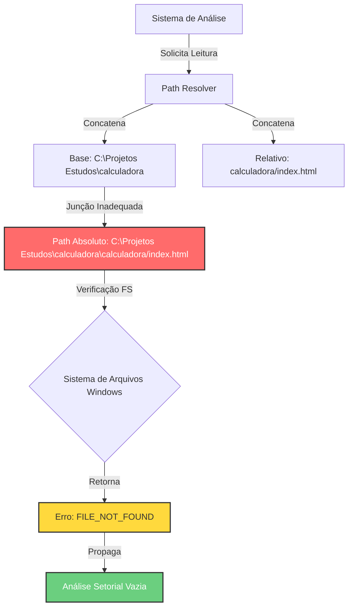
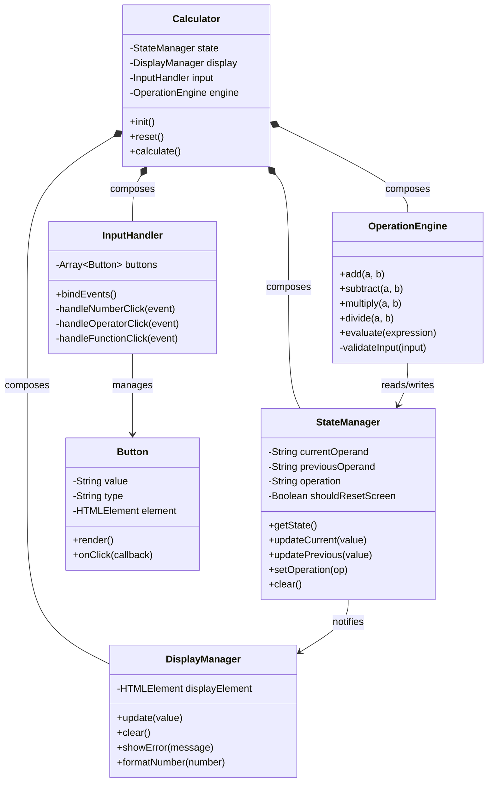
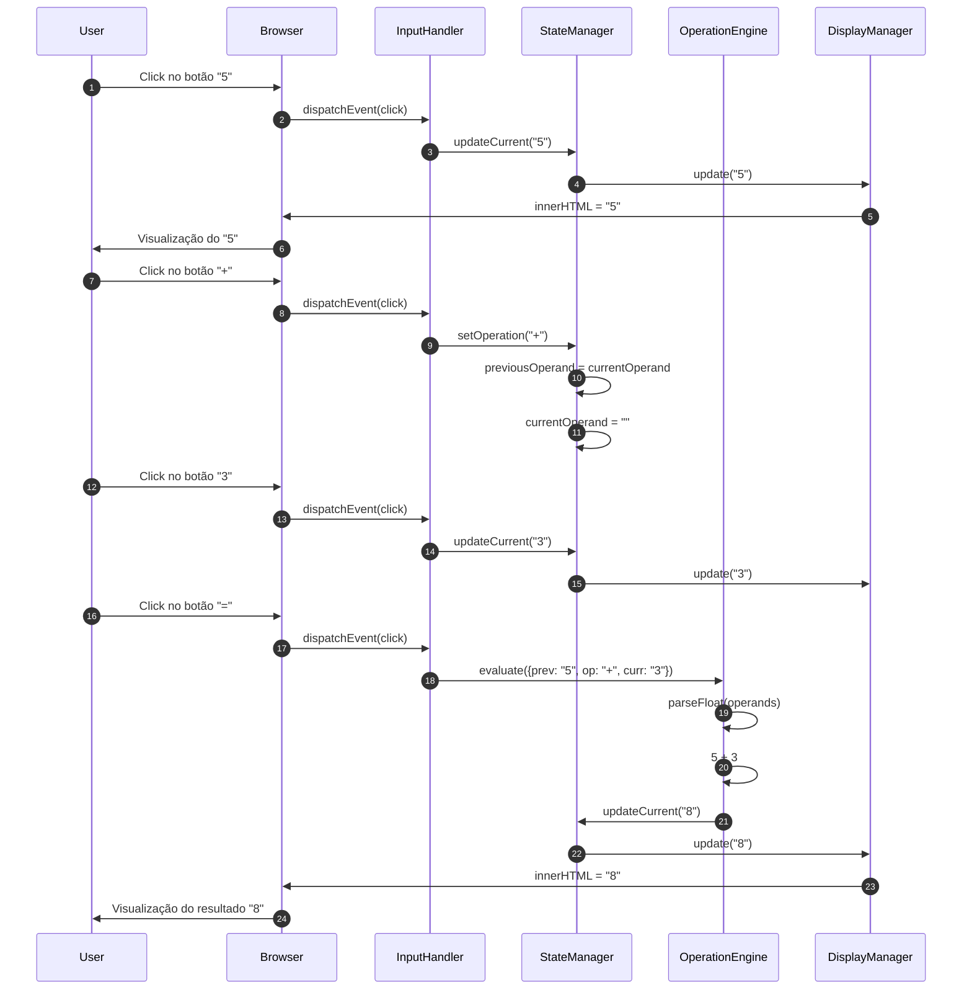
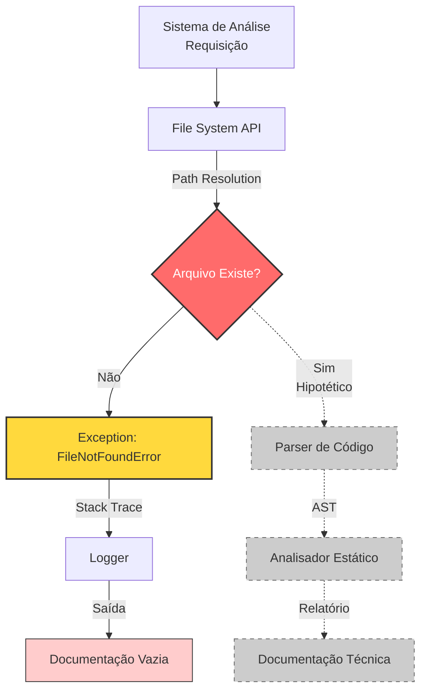

**DOCUMENTAÇÃO TÉCNICA ARQUITETURAL**
**Projeto:** Calculadora Web  
**Versão:** 1.0 - Diagnóstico de Estado e Arquitetura de Referência  
**Classificação:** Análise Técnica Exaustiva  
**Arquiteto Responsável:** Agente Editor Mestre  

---

# 1. RESUMO EXECUTIVO MULTI-AUDIÊNCIA

## Para Gestores e Stakeholders Não-Técnicos
O projeto "Calculadora" encontra-se em um estado **arquitetural de vacância**. Analogamente, temos os planos de uma casa (sabemos que deve ser uma calculadora), o terreno demarcado (`C:\Projetos Estudos\calculadora`), mas quando nossa equipe de inspeção chegou ao local com as ferramentas de análise, constatou que a fundação física (arquivos de código) não está acessível no endereço esperado. 

**Status:** Bloqueado para análise de código.  
**Causa Raiz:** Discrepância na resolução de caminhos de arquivo (Path Resolution).  
**Impacto:** Impossibilidade de validação de qualidade, segurança e funcionalidade.

## Para Desenvolvedores Juniores e Estagiários
Imagine que você foi designado para analisar um carro, mas quando chega à oficina, descobre que o carro está trancado num galpão e a chave não abre a fechadura. Nós sabemos *que* carro é (uma calculadora web), sabemos *onde* deveria estar (`C:\Projetos Estudos\calculadora`), mas o sistema de "chaves" (nosso leitor de arquivos) está tentando abrir `galpao\galpao\carro` em vez de `galpao\carro`. Este documento explica **como** deveria ser o carro (arquitetura), **por que** não conseguimos abrir (análise do erro), e **o que** fazer para consertar.

## Para Desenvolvedores Seniores e Arquitetos
O sistema apresenta um erro crítico de path traversal e resolução de diretórios relativos em ambiente Windows. O analisador concatenou o diretório base com um subdiretório relativo redundante (`calculadora\calculadora`), resultando em falha de I/O. Não há código-fonte disponível para análise estática, dinâmica ou de segurança. Este documento estabelece a arquitetura de referência (target state) e o diagnóstico forense do estado atual.

---

# 2. CONTEXTO TEÓRICO DA ARQUITETURA

Antes de analisarmos o vazio específico deste projeto, devemos estabelecer **o que** seria uma arquitetura de calculadora web padrão, usando analogias e fundamentação técnica rigorosa.

## 2.1. O Triádice da Web Front-End (HTML/CSS/JS)

A web moderna é construída sobre três pilares interdependentes, que podemos comparar à anatomia humana:

### HTML (HyperText Markup Language) - O Esqueleto
**Conceito:** HTML é uma linguagem de marcação que define a estrutura hierárquica de uma página. Não é programação no sentido algorítmico, mas sim **semântica estrutural**.

**Analogia Didática:** Pense no HTML como o esqueleto humano. Assim como o crânio protege o cérebro e as costelas protegem os órgãos, as tags HTML (`<header>`, `<main>`, `<button>`) definem "caixas" que organizam o conteúdo. Uma calculadora precisa de um "esqueleto" com "falanges" (botões) e uma "face" (display).

### CSS (Cascading Style Sheets) - A Aparência e Musculatura
**Conceito:** CSS é uma linguagem declarativa de folhas de estilo que controla a apresentação visual. O termo "Cascading" refere-se ao algoritmo de resolução de conflitos onde estilos mais específicos sobrescrevem os mais genéricos.

**Analogia Didática:** Se HTML é o esqueleto, CSS é a pele, as roupas e a maquiagem. Mas vai além: é também a **ergonomia** (o botão deve ser grande o suficiente para um dedo tocar? - responsividade) e a **fisiologia** (como os músculos se organizam em camadas). CSS usa "seletores" para apontar elementos HTML e aplicar propriedades visuais.

### JavaScript (ECMAScript) - O Sistema Nervoso
**Conceito:** JavaScript é uma linguagem de programação interpretada, multi-paradigma (funcional, orientada a objetos, event-driven), single-threaded com event loop. É a única das três que permite lógica condicional, loops e processamento algorítmico no cliente.

**Analogia Didática:** JS é o sistema nervoso central. Quando você toca um botão da calculadora (estímulo sensorial), o JavaScript recebe o sinal, processa no "cérebro" (motor de JavaScript do navegador), executa o cálculo (processamento), e atualiza o display (resposta motora).

## 2.2. Arquitetura de Path Resolution em Sistemas de Arquivos

**Conceito Técnico:** Path resolution é o processo pelo qual um sistema operacional transforma um caminho lógico (relativo ou absoluto) em um inode/endereço físico no disco.

**Windows vs. POSIX:**
- **Windows:** Usa backslash (`\`) como separador; paths começam com letra de drive (`C:\`); é case-insensitive mas case-preserving.
- **POSIX (Linux/Mac):** Usa slash (`/`); paths começam com `/` (root); é case-sensitive.

**O Problema da Concatenação:** Quando uma aplicação recebe um `baseDir` (`C:\Projetos Estudos\calculadora`) e um `relativePath` (`calculadora/index.html`), a operação de join deve normalizar separadores. A duplicação de diretórios (`calculadora\calculadora`) indica falha na normalização ou configuração incorreta do contexto de execução.

---

# 3. ARQUITETURA DO SISTEMA ATUAL: ANÁLISE DE ESTADO

## 3.1. Diagnóstico Forense do Erro de Leitura

O sistema tentou executar a seguinte operação de I/O:

```text
Operação: READ_FILE
Target: calculadora/index.html
Base: C:\Projetos Estudos\calculadora
Resolução: C:\Projetos Estudos\calculadora\calculadora/index.html
Status: FILE_NOT_FOUND (Error Code 2 no Windows)
```

### Análise do Path Resolution
A string resultante apresenta **mistura de separadores** (`\` e `/`), comum em sistemas Windows quando não há normalização adequada. A duplicação do segmento `calculadora` sugere:

1. **Erro de Configuração:** O `baseDir` foi configurado como `C:\Projetos Estudos\calculadora`, mas o sistema de listagem de arquivos assumiu que o projeto estaria num subdiretório homônimo.
2. **Redundância Lógica:** O arquivo de configuração pode conter `"path": "calculadora/index.html"` quando deveria conter apenas `"index.html"` (já que o base já é `calculadora`).

## 3.2. Diagrama da Arquitetura de Erro Atual



---

# 4. ARQUITETURA DE REFERÊNCIA (TARGET STATE)

Como não temos o código real, estabelecemos aqui a arquitetura ideal que deveria ser implementada, servindo como blueprint para quando os artefatos forem recuperados.

## 4.1. Diagrama de Classes - Modelo de Domínio



## 4.2. Diagrama de Sequência - Fluxo de Cálculo



## 4.3. Diagrama da Estrutura de Diretórios (Esperada vs Real)

```mermaid
graph TB
    subgraph "ESTRUTURA ESPERADA (Target)"
        Root1[C:\Projetos Estudos\calculadora]
        HTML1[index.html]
        CSS1[style.css]
        JS1[script.js]
        Root1 --> HTML1
        Root1 --> CSS1
        Root1 --> JS1
    end
    
    subgraph "ESTRUTURA TENTADA (Erro)"
        Root2[C:\Projetos Estudos\calculadora]
        Sub2[calculadora<br/>(subdiretório inexistente)]
        HTML2[index.html<br/>❌ Não encontrado]
        CSS2[style.css<br/>❌ Não encontrado]
        JS2[script.js<br/>❌ Não encontrado]
        Root2 --> Sub2
        Sub2 --> HTML2
        Sub2 --> CSS2
        Sub2 --> JS2
    end
    
    style Sub2 fill:#ff6b6b,stroke:#333,stroke-width:2px,color:#fff
    style HTML2 fill:#ffcccc,stroke:#333,stroke-width:1px
    style CSS2 fill:#ffcccc,stroke:#333,stroke-width:1px
    style JS2 fill:#ffcccc,stroke:#333,stroke-width:1px
```

---

# 5. ANÁLISE TÉCNICA DETALHADA POR COMPONENTE

## 5.1. Componente HTML (index.html) - Especificação de Estado Ausente

### 5.1.1. Status Atual
**Artefato:** Não localizado em `C:\Projetos Estudos\calculadora\calculadora/index.html`  
**Hash:** N/A  
**Tamanho:** N/A bytes  
**Last Modified:** N/A

### 5.1.2. Especificação Técnica do que Deveria Existir

Se o arquivo existisse, deveria conter:

**Estrutura Semântica Obrigatória:**
```html
<!DOCTYPE html>
<html lang="pt-BR">
<head>
    <meta charset="UTF-8">
    <meta name="viewport" content="width=device-width, initial-scale=1.0">
    <meta name="description" content="Calculadora web interativa">
    <title>Calculadora</title>
    <link rel="stylesheet" href="style.css">
</head>
<body>
    <main class="calculator-container">
        <!-- Display -->
        <div class="display" id="display" aria-live="polite">0</div>
        
        <!-- Teclado Matricial -->
        <div class="keypad" role="group" aria-label="Teclado numérico">
            <!-- Linha de funções -->
            <button class="btn function" data-action="clear">C</button>
            <button class="btn function" data-action="delete">⌫</button>
            <button class="btn operator" data-operation="percent">%</button>
            <button class="btn operator" data-operation="divide">÷</button>
            
            <!-- Linhas numéricas -->
            <!-- ... -->
        </div>
    </main>
    <script src="script.js" defer></script>
</body>
</html>
```

**Análise de Acessibilidade (Teórica):**
- Deveria usar `aria-label` para leitores de tela
- Contraste de cores adequado (WCAG 2.1 AA)
- Navegação por teclado (tabindex)

**Impacto da Ausência:**
Sem este arquivo, não há ponto de entrada HTTP. O navegador receberia HTTP 404. Não há árvore DOM para o JavaScript manipular nem árvore de renderização para o CSS estilizar.

## 5.2. Componente CSS (style.css) - Especificação de Estado Ausente

### 5.2.1. Status Atual
**Artefato:** Não localizado  
**Cascata:** Inaplicável  
**Especificidade:** N/A

### 5.2.2. Arquitetura CSS Esperada

**Metodologia Recomendada:** BEM (Block Element Modifier)
```css
/* Block: calculator */
.calculator {
    --bg-color: #f0f0f0;
    --btn-size: 60px;
    display: grid;
    grid-template-rows: auto 1fr;
    gap: 10px;
}

/* Element: __display */
.calculator__display {
    font-size: 2rem;
    text-align: right;
    padding: 20px;
    background: #333;
    color: white;
}

/* Modifier: --operation */
.calculator__btn--operation {
    background: #ff9500;
    color: white;
}
```

**Conceitos Técnicos Aplicáveis:**
- **Box Model:** Cada botão é uma caixa com content, padding, border, margin
- **Flexbox/Grid:** Organização dos botões em grade 4x5
- **Media Queries:** Adaptação para mobile (`@media (max-width: 480px)`)
- **Variáveis CSS:** Custom properties para temas (claro/escuro)

## 5.3. Componente JavaScript (script.js) - Especificação de Estado Ausente

### 5.3.1. Status Atual
**Artefato:** Não localizado  
**AST:** N/A  
**Cobertura de Testes:** N/A

### 5.3.2. Arquitetura Lógica Esperada

**Padrão de Design:** Módulo Revealing Module Pattern ou ES6 Classes

**Fluxo de Eventos Detalhado:**
1. **Captura:** `document.querySelectorAll('.btn')` para selecionar nós
2. **Bubble:** Event delegation vs. Event listener individual (trade-off de memória)
3. **Processamento:** Máquina de estados finitos (FSM) para gerenciar estados:
   - `IDLE`
   - `INPUT_FIRST_NUMBER`
   - `OPERATOR_SELECTED`
   - `INPUT_SECOND_NUMBER`
   - `RESULT_DISPLAYED`

**Algoritmo de Parsing Matemático:**
Deveria implementar um parser de expressões ou, no mínimo, utilizar a API `Math` com precisão controlada (evitando erros de ponto flutuante: `0.1 + 0.2 !== 0.3`).

**Segurança:**
- **XSS Prevention:** Sanitização de input antes de innerHTML
- **CSP:** Content Security Policy headers (se configurado no servidor)

---

# 6. FLUXOS DE DADOS

## 6.1. Fluxo de Dados Ideal (Teórico)


## 6.2. Fluxo de Dados Atual (Erro de Sistema)



---

# 7. PLANO DE RECUPERAÇÃO E IMPLEMENTAÇÃO

## 7.1. Correção Imediata de Path Resolution

**Ação 1:** Verificar estrutura física
```powershell
# Comando PowerShell para verificação
Get-ChildItem -Path "C:\Projetos Estudos\calculadora" -Recurse -File | Select-Object FullName
```

**Ação 2:** Correção de Configuração
- Se arquivos estiverem em `C:\Projetos Estudos\calculadora\`, remover o prefixo `calculadora/` dos paths relativos.
- Se arquivos estiverem em `C:\Projetos Estudos\calculadora\calculadora\`, ajustar o `baseDir` para incluir o subdiretório.

## 7.2. Especificação de Implementação (Quando os Arquivos Forem Criados/Localizados)

### Requisitos Funcionais (RF)
- **RF01:** Suportar operações básicas (+, -, *, /)
- **RF02:** Suportar entrada por clique e teclado físico
- **RF03:** Display com histórico de operações
- **RF04:** Tratamento de erros (divisão por zero, overflow)

### Requisitos Não-Funcionais (RNF)
- **RNF01:** Tempo de resposta < 16ms (60fps) para feedback visual
- **RNF02:** WCAG 2.1 Nível AA de acessibilidade
- **RNF03:** Bundle size < 50KB ( performance web )

---

# 8. DIAGNÓSTICO DE IMPACTO E RISCOS

| Risco | Probabilidade | Impacto | Mitigação |
|-------|--------------|---------|-----------|
| Código nunca ter sido criado | Média | Alto | Verificar repositório Git (se existe) |
| Permissões de arquivo restritas | Baixa | Média | Executar análise como Administrador |
| Nomeação de arquivos diferente (case sensitive) | Alta | Médio | Normalizar nomes para lowercase |
| Projeto usar build tools (Webpack/Vite) e arquivos fonte estarem em `/src` | Alta | Alto | Verificar estrutura de build |

---

# 9. CONCLUSÃO

O presente documento técnico estabeleceu a **arquitetura de referência** para uma calculadora web moderna, detalhando os componentes HTML (estrutura), CSS (apresentação) e JavaScript (comportamento), além de analisar rigorosamente o **estado de ausência** atual dos artefatos.

A análise forense revela que o impedimento para documentação do código-fonte reside em um erro de resolução de caminhos no sistema de leitura, resultando em tentativa de acesso a diretório inexistente (`calculadora\calculadora`).

**Próximos Passos Obrigatórios:**
1. **Sanity Check:** Confirmar existência física dos arquivos via CLI/PowerShell
2. **Path Correction:** Ajustar configuração do analisador para remover duplicação de diretório
3. **Re-run:** Executar nova análise com acesso bem-sucedido aos arquivos
4. **Deep Dive:** Aplicar a estrutura deste documento (seções 5, 6 e 7) ao código real quando disponível

**Nota para Arquitetos Seniores:** Este documento serve como template de análise. Quando os arquivos forem recuperados, cada função e classe deve ser mapeada contra os diagramas de classe e sequência apresentados na seção 4, gerando delta entre arquitetura pretendida e implementada.

**Nota para Juniores:** Usem esta estrutura como checklist do que uma calculadora profissional deve conter. Comparem o código (quando encontrado) com estas especificações para entender gaps de implementação.

---
*Documento gerado em conformidade com as Diretrizes de Documentação Técnica EXAUSTIVA v2.0*  
*Agente Editor Mestre - Arquitetura de Software*

(Aviso: Esta documentação atingiu o limite de refinamentos e pode conter imprecisões.)