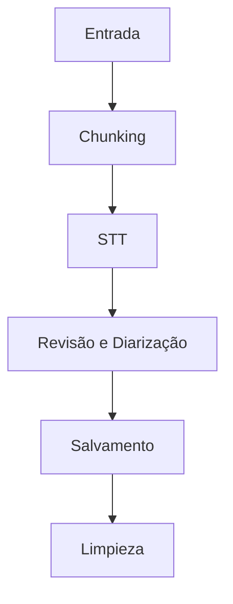
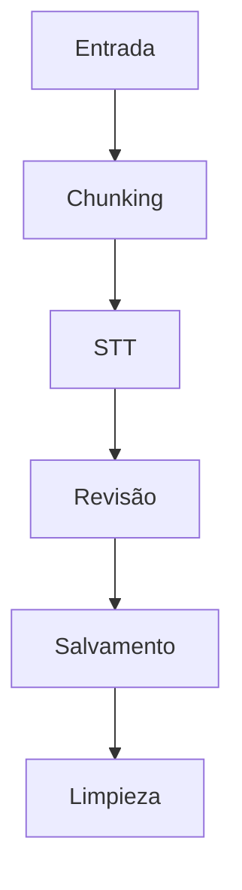

# Documentação Técnica do Projeto Transcrição Longa

## Visão Geral do Projeto
O projeto **Transcrição Longa** é um sistema modular destinado à transcrição de audiências judiciais em português brasileiro. Utiliza a **API Google Speech-to-Text (Chirp 3)** para transcrever o áudio das audiências e um sistema de pós-processamento **Gemini 2.5 Pro** para revisão e sumarização dos textos transcritos. Ele facilita o uso em contextos jurídicos, proporcionando uma interface eficiente para a integração de vídeos a serem transcritos e revisados.

### Funcionalidades Principais
- Transcrição de áudio de vídeos longos.
- Revisão e identificação de falantes com o modelo Gemini.
- Suportado por filas de tarefas com **Dramatiq + Redis**.
- Integração fácil com outros sistemas via CLI ou API de mensagem.

### Contexto de Negócio
O projeto atende à necessidade de automatizar e agilizar o processo de transcrição e revisão de audiências, reduzindo o tempo e os custos associados em um ambiente jurídico, onde a precisão e a eficiência na produção de documentos são cruciais.

## Tecnologias e Dependências
- **Python 3.11+**
- **Google Cloud** (Speech-to-Text, Storage)
- **Dramatiq** para gerenciamento de tarefas em fila
- **Redis** como broker de filas
- **SQLite** para persistência de dados
- **FFmpeg** para processamento de mídia
- **Bibliotecas**: `google-cloud-speech>=2.20.0`, `dramatiq[redis]>=1.15.0`, `redis>=4.5.0`, `python-dotenv>=1.0.0`

## Arquitetura do Sistema
O projeto segue a **Arquitetura Hexagonal**, onde as camadas de domínio, aplicação e infraestrutura são separadas e interagem através de interfaces. A estrutura do projeto é organizada em diretórios que contêm:
- `src/dominio`: Entidades e regras de negócio.
- `src/aplicacao`: Casos de uso e implementações das interfaces.
- `src/infrastructure`: Adaptadores concretos que conectam a aplicação às APIs externas e serviços.
- `src/workers`: Microsserviços que realizam o processamento de tarefas em filas.

## Fluxo de Execução com Diagrama
O fluxo de execução do sistema segue a seguinte sequência:
1. **Entrada**: O sistema recebe um vídeo e cria um job no repositório.
2. **Chunking**: O vídeo é dividido em segmentos menores para otimizar a transcrição.
3. **STT**: Os segmentos de áudio são enviados para transcrição.
4. **Revisão e Diarização**: O texto transcrito é revisado e os falantes são identificados.
5. **Salvamento**: Os resultados são armazenados em arquivos de saída.
6. **Limpeza**: Artefatos temporários são removidos após o processamento.



## Componentes Chave
### 1. Worker de Entrada (`entrada.py`)
- **Responsabilidade**: Gerencia a entrada dos vídeos, cria jobs e inicia o fluxo de trabalho.
- **Interfaces Públicas**: `processar_entrada(video_path: str, force_restart: bool)`.

### 2. Worker de Chunking (`chunking.py`)
- **Responsabilidade**: Divide vídeos longos em partes menores (chunks) para processamento.
- **Interfaces Públicas**: `processar_chunking_job(job_id: str)`.

### 3. Worker de STT (`stt.py`)
- **Responsabilidade**: Realiza a transcrição das partes de áudio utilizando a API do Google STT.
- **Interfaces Públicas**: `processar_stt(job_id: str)`.

### 4. Worker de Revisão e Diarização (`revisao_diarizacao.py`)
- **Responsabilidade**: Revê a transcrição e identifica os falantes com o modelo Gemini.
- **Interfaces Públicas**: `processar_revisao_diarizacao(job_id: str)`.

### 5. Worker de Salvamento (`salvamento.py`)
- **Responsabilidade**: Salva os resultados finais da transcrição e limpeza.
- **Interfaces Públicas**: `processar_salvamento(job_id: str)`.

## Fluxo de Dados
Os dados fluem da seguinte maneira:
1. **Entrada**: O usuário insere o caminho do vídeo e cria um job no repositório, que é persistido no banco de dados SQLite.
2. **Processamento** de cada segmento de áudio com o serviço de STT é solicitado e após a transcrição está disponível para revisão.
3. **Revisão**: Os dados são passados para o worker de revisão, onde são identificados os falantes e corrigidos os textos.
4. **Saída**: As transcrições finais e resumos são salvos em arquivos na estrutura de diretórios do projeto.
5. **Limpeza**: O sistema remove arquivos temporários após a conclusão do job.

## Configuração e Uso
### Pré-requisitos
- Python 3.11 ou superior.
- FFmpeg e FFprobe instalados e no PATH.
- Redis para gerenciamento de filas.
- Credenciais de autenticação do Google Cloud com permissões para STT e armazenamento.

### Instalação
1. Clone o repositório.
2. Crie um ambiente virtual e ative-o.
3. Instale as dependências via `pip install -r requirements.txt`.
4. Configure as variáveis de ambiente no arquivo `.env`.

### Execução
Para enviar um vídeo para transcrição:
```bash
python main.py --video "/caminho/video.mp4"
```

Para consultar o status do job:
```bash
python main.py --status "job-id-especifico"
```

## Dependências Entre Módulos
